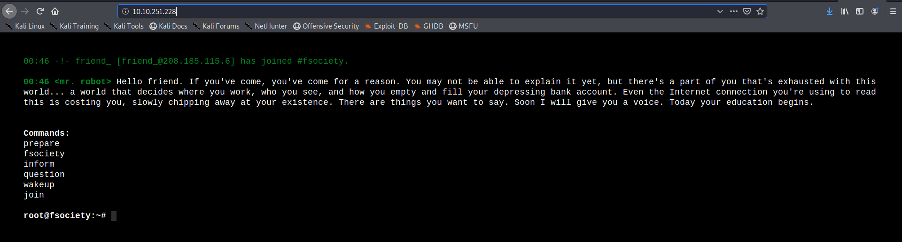
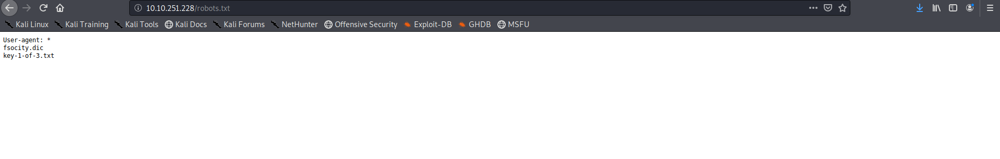
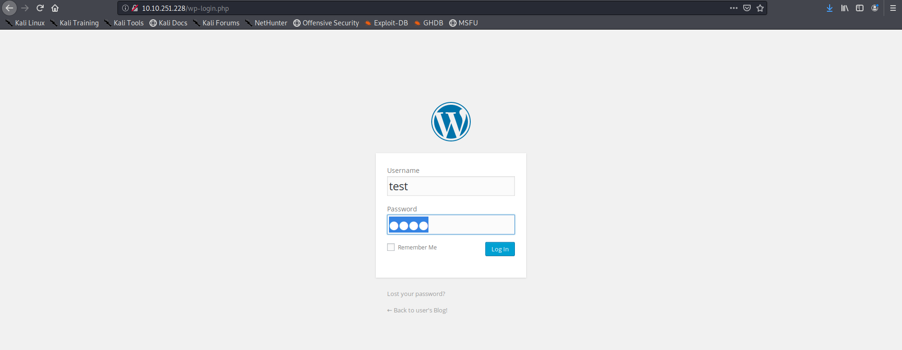
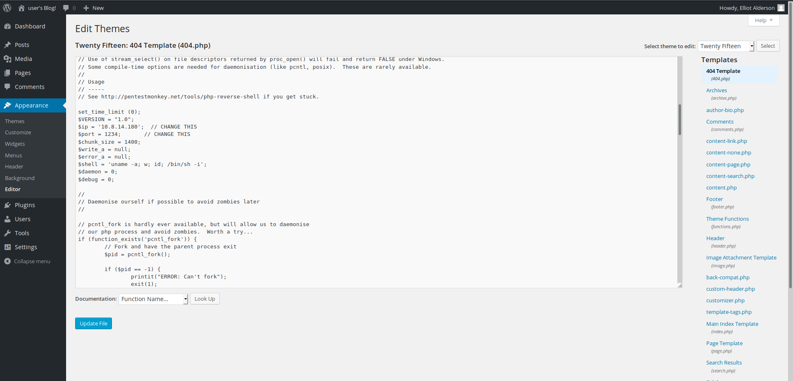

So we start with basic enumeration

So ports 80,443 is open nothing special here lets check the site

nothing to find here to lets check the robots.txt file

yup there is the first flag for us
lets get it 

now we download the dictionary file 
running nikto

Nothing interesting here as well,now on running gobuster we got that it has Wordpress CMS so lets try for wp-login.php page 

yup its there lets check for username from the dictionary 
it was elliot kind of guessed it before

now using burp to capture the requests and use hydra

Since the dictionary had lot of duplicates I used used uniq command to make new dictionary so number of tries we have to do be less

lets login using the found pass we get the dashboard

Lets check the editor ,we can edit the 404.php to get php rev-shell lets change the contents of 404.php and get the shell

Stabilising the shell using python

Couldn't read the key but got the md5 hash of the user lets crack it online

Lets login and get key 2

now checking for vulnerable binaries got nmap 

using nmap --interactive to get the shell
as the nmap version being used is very old

got the key 3 as well was a good box learnt about how to use nmap vulnerability 

<b>
Happy Hacking
</b>
