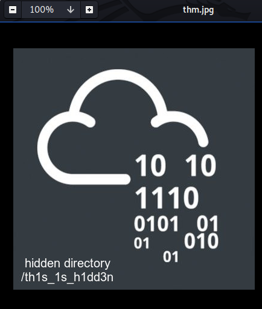
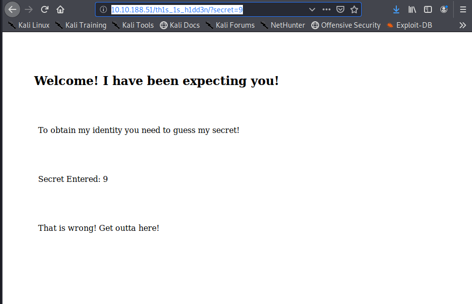
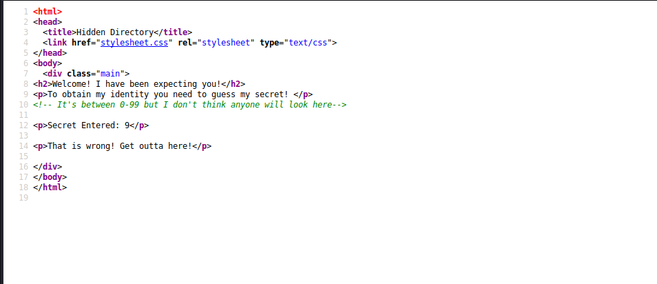
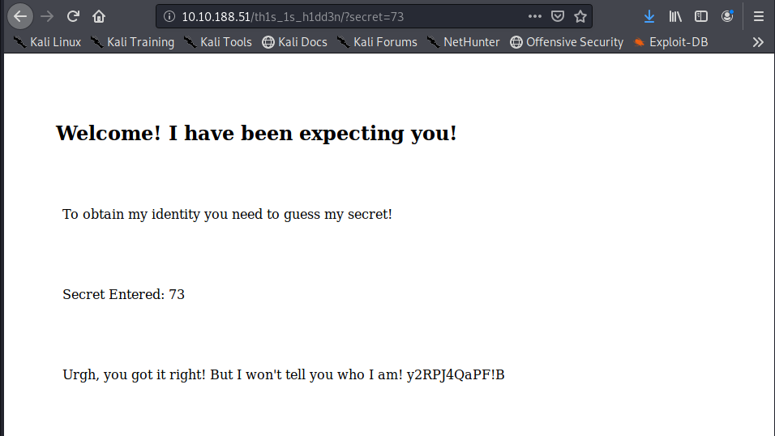
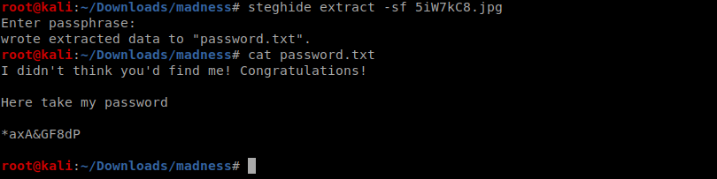
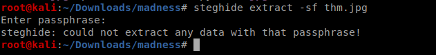

<!--more-->

First of all as we know its nmap scan as always


so we have ports 22,80 open ;lets check the website


we can see a not loadable image lets view that image


lets download and check its hex 


as you can see why there is a png header in jpg image so lets repair and view the image



we get a hidden directory lets acesss it 



lets check the source 



so we have to brute-force the secret so I wrote a short python script to do this
```python
import requests


url ="http://10.10.188.51/th1s_1s_h1dd3n/?secret="

for i in range(0,100):
	response=requests.get(url+str(i))
	
	if("That is wrong!" in response.text):
		print(i)
		continue
	else:
		print("correct secret :",i)
		break

``` 
this gave me the correct secret as 73



I tried bruteforcing the ssh with hydra using the the string given above but it was already written above that this is not the username 
***such a fool***
so now I tried to steghide the image given on the challenge page  



Yupp this gave me the password without any passphrase

So I tried to extract the thm.jpg file also without any passphrase
but did not get anything



now with the passphrase we got by entering the secret
it got me a username


but as it was given in the hint 
its ROTen so trying rot13 gives the user


Lets login and get the user flag first


Now lets search for SUID binaries
we got this result


Now the screen-4.5.0 looks interesting 
Using my GOOGLE_FU skills I got this vulnerability


lets copy this script to /tmp directory and run it
we got the flag 


<b><center>Happy Hacking!!</center></b>