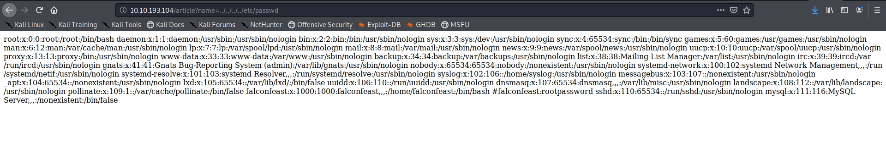
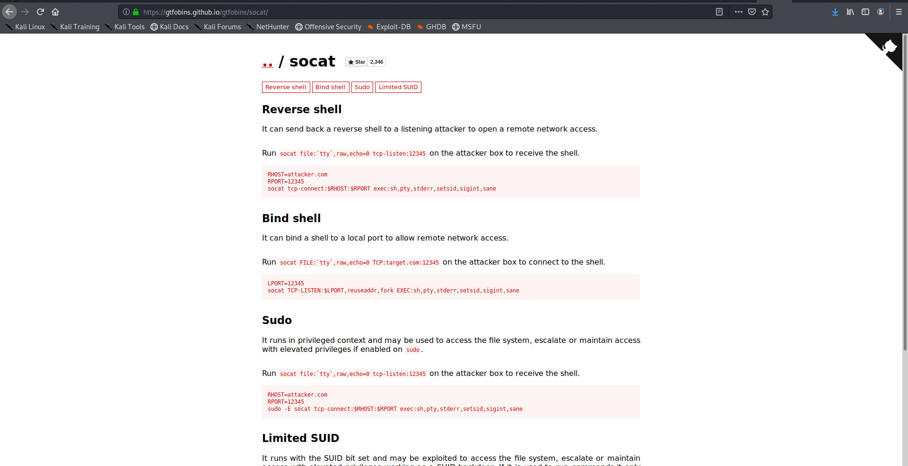

<!--more-->
Basic nmap scan as always 

Open ports are 22,80
Nothing interesting here 
lets checkout the website

Here lets checkout LFI-Attack because **obviously**

So I think it is reading the lfiattack named file
so lets change the file to /etc/passwd

we get the credentials as a comment so lets 
login

so we got the user flag 
and we can run the socat as root
so lets checkout GTFObins for socat

lets configure the env variable and keep the port listening on our machine

so on running the socat on our terminal I get the root terminal 

So we got the root on the machine and the flag

That's all and Remeber

<b>
Enumeration Is The Key!!
</b>
