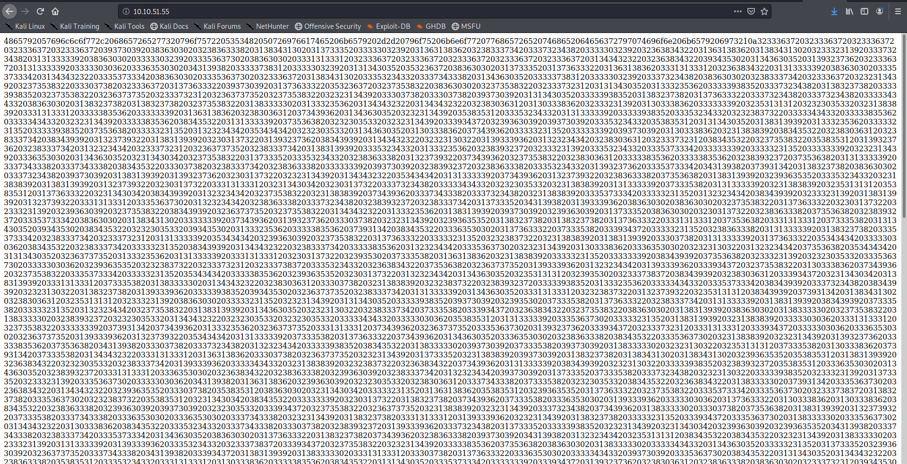
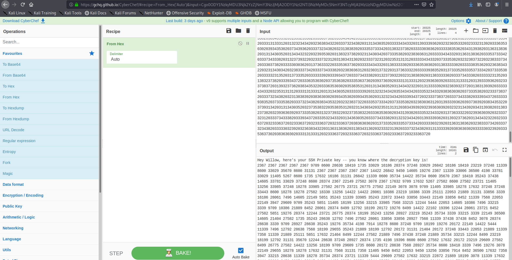
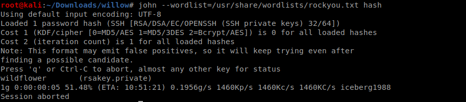
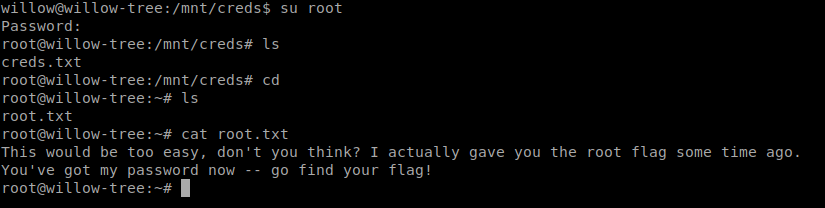

<!--more-->

Lets start with the nmap scan on the machine we can see that three ports are open
namely ssh ,http ,nfs


lets checkout the http port we get this



Lets decode it using cyberchef



so we are given the ssh login key in numerical form which can be converted to actual key if we know the private key and public exponent

lets checkout the nfs port


So we get the private key and modulus

so we can write a quick python script like this to get the ssh private key

```python
priv=61527
pub=37627

with open("ssh_raw", "r") as raw_text:
    data = [int(i.strip("\n")) for i in raw_text.read().split(" ")]

for i in data:
	print(chr(i**priv%pub),end="")
```


saving the key and brutforcing its password using ssh2john



we get the password 
lets login!!


lets copy the user.jpg to our local system


it contains our user flag 


lets continue with further enumeration 
the command `sudo -l` give us the following results 


So we can use mount as root so we mount the `hidden_backup` folder to `/mnt/creds` directory and view the contents

After priv-esc to root we check root.txt 
so it give us this 



So it clocked that there maybe a file hidden in user.jpg image as said in root.txt so lets use the root password as passphrase and yup we got the flag


Nice Box , Had lot of fun while figuring out the root flag 

<b><center>Happy Hacking!!</center></b>