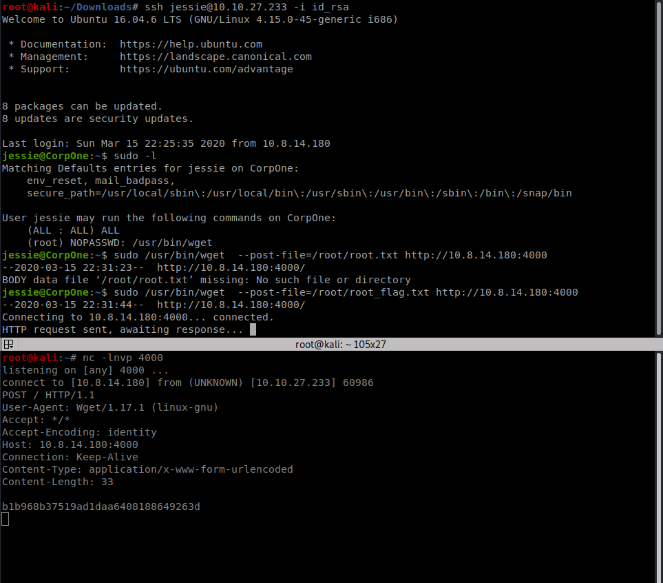

<!--more-->
Nmap Scan Results:-

Nothing interesting in the nmap scan lets check out the http page

On checking the source of index.html we get this

So Jessie is a user for this box
Nice ,A thing to **remember**
Lets start with gobuster enumeration

Sitemap directory seems interesting
lets check it out 

Doesn't give any special information 
so lets recursive scan into the sitemap directory 

<b>Interesting!!</b>
we find a .ssh directory 
On checking it out we get a rsa key
Lets check wether this key has any password or not??

Lets quickly change the permissions of the rsa key and login!!

We get the user flag 
lets check `sudo -l`
so we can run `wget` as root nice checking for wget priv-esc we can easily find so many exploits
I used this --

Lets HAck~~~

SO that's it we get the root flag as well
easy box nothing much to explain here!! 
Remember always !!

<b>
Enumeration Is The Key!!
</b>