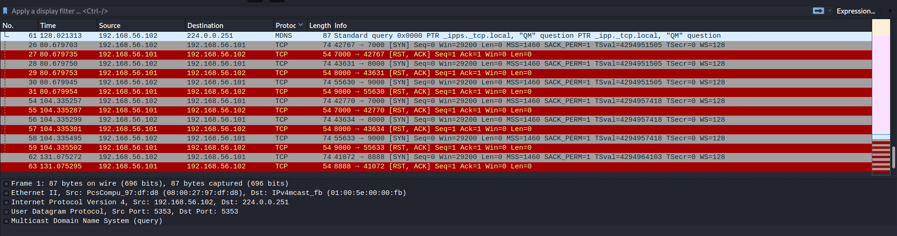
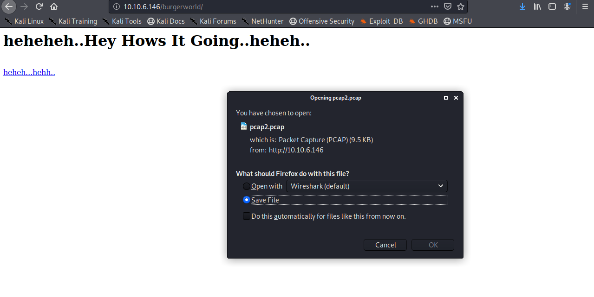
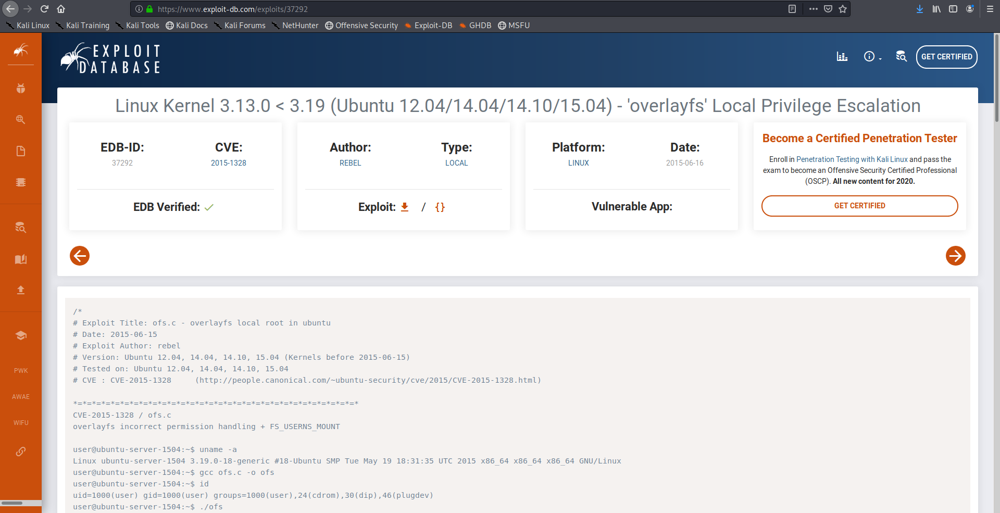

<!--more-->
Nmap scan results show nothing peculiar to explain

lets visit the webpage and download the pcap 

the above screenshot show the order in which port were knocked so lets use the port knocker [script](https://github.com/grongor/knock)

now lets knock the ports in order shown and telnet the last port

we get a hidden directory lets access the directory and download the 2nd pcap file 

On following one of the tcp streams in the pcap file I find this 
looks like some kind of foreign language 

It translates to 1 3 3 7 
so this must be the ports to knock

we get another hidden directory so lets check it 
seem like base64 lets check

So it gives us the ports to knock and then ssh

we get the username password lets login

but as soon as we login the system logs us out

so lets try the same command with `/bin/bash` in additon to it as we get the shell

lets stabilise it using tty
and `sudo -l` to check the permissions 

so the system name looked suspicious 
so I looked into it and found that the linux version is outdated and vulnerable so 
I checked for it online

so we have to compile the code on the machine so I transferred the ofs.c to the box using scp and compiled it to get the binary and then ran it to get the root shell

So nice box !
My first kernel exploit so it was great getting the root shell without any roadblocks 

<b>
Happy Hacking!!
</b>