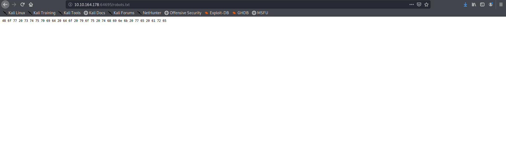
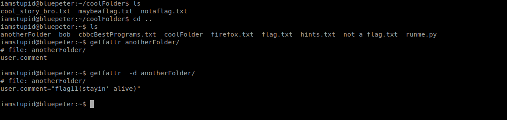

<!--more-->
So as always lets start with a nmap scan

So we have ports 22 and 64695 
As we dont have any information about the ssh port
lets check the other port

Looks like the page is toggling between two pages continuously 
lets take a look at the source of each page

the above flag also gave us one of the flags
so we got **flag4**

So we can see the hints to the pages available on the machine first lets look at robots.txt
On decoding the hex its just a troll message nothing useful

Others pages also contained troll messages which frustated me a lot 
finally got to page containing ssh creds

Lets login using the creds we got earlier

So we got the **flag1**

Lets take a look at hints

there is a flag in the hints itself read carefully lol
we got **flag8**

There is a flag hidden in bob's home directory we use recursive grep to get the flag 
we got **flag3**

so there is a flag there is coolFolder ,the hints told us to check the attributes lets check the attributes and yes we got the flag!!
we have **flag2**

In same way we the hints told to check for attributes for anotherFolder
Very easily we get the **flag11**

There is also a flag hidden in /etc/passwd file
We now have **flag6**

So now for the final flag on the machine we need to login as *cbbcadmin* and check his home directory 
So hints gave 6 of the 9 char of cbbcadmin's password we can easily generate the wordlist using crunch and then try bruteforcing using hydra 
I am not going to give you the password out its a task for you 

SO finally we got the last flag on the machine 

Getting root was very easy I don't think I need to tell you the process you can find it out in seconds!!

thats it for this box

<b>
Keep Enumerating!!
</b>