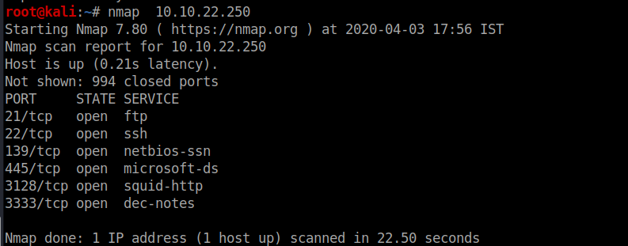
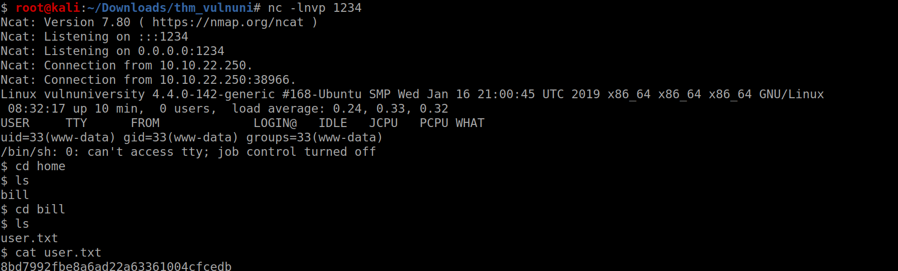

<!--more-->
Lets start with the basic nmap scan

This showed that there were 6 ports open on the machine 
ftp was useless as anon login was not allowed 
so the only option was the http website
lets visit the website on port on 3333

This also does not give us anything useful so lets try using gobuster 

We get an interesting directory named **internal** 
lets check it out

So it allows us to upload files to the machine 
lets if we can access the files uploaded by us

Searching for sub-directories inside `internal` directory

So we got the uploads directory 
Lets check it out

so I got my php rev shell listed so lets open up a netcat listner and get the rev-shell

So I got the user flag 

Lets search the suid binaries

On searching for the suid binaries I came across **systemctl** binary,It looked interesting 
On searching systemctl on gtfobins I got this

Lets try getting the root flag using this 

So this was a very straight forward maching no need for any ***crazy*** things

<b>
Keep Enumerating!!
</b>