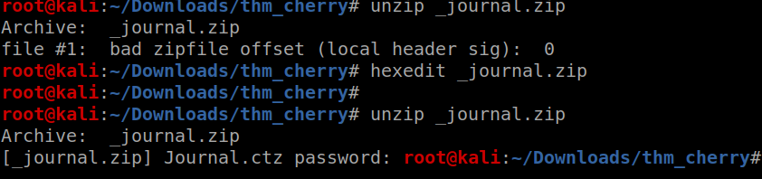
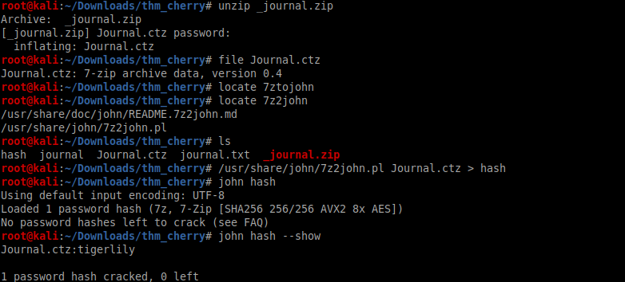
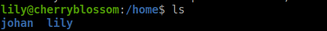
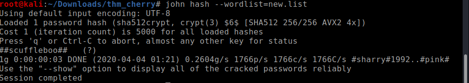

<!--more-->

Nmap scan as usual

Seeing port 445 open means that it must be SAMBA!!
lets use enum4linux
ANd yes there is an open share on the smb server

Lets access the share using smbclient

We got a text file ,it had a base64 encoded string so copying the contents of the journal.txt file into new file after base64 decoding
it turns out to be a png file after checking out many tools I finally got a zip file using **stegpy**

WHile trying to unzip the zip it showed that it was corrupted so after 
getting the file headers correct and trying to unzip for the file it asked for password 

I know many people like to use fcrackzip for password cracking but I love JohnTheRipper its da best 
And almost instantly I got the password

after unzipping the zip I got a ctz file I knew that it was a Cherry tree document but when I used cherry tree to open the file it asked for password 
A quick google search on cracking ctz file password gave us that we need to use `7ztojohn` for password cracking

Viewing the contents of the document we got the first flag as well as 
the wordlist to use for ssh bruteforce

LEts quickly merge all the worlists into a new file and get to the bruteforce

SO we got the creds using hydra

lets login 
It seems that there are two users on the machine and Johan is the the person who wrote the diary as **J**

using linPEAS I got to know about a backup file 
on checking it out it turns out to be backup of shadow file
SO we get the hash for johan user

Lets use john as always but make sure to use the wordlist that we made earlier not the great **rockyou.txt**,It might blow up your computer due to the load,LOL

Lets login 
I forgot to get the user flag first lets take it 

when I used sudo -l the password was shown as asterisks on the screen,seems that its a sudo vulnerablity 
I will leave that on you to find out the exploit for this vulnerablity

lets run the exploit and get the root

**EZ PZ**

So this was one of the most time-consuming boxes on tryhackme that I have solved
Its was a great feeling when I cracked anything using JOhn 

Anyways,

<b>
Happy Hacking!!
</b>