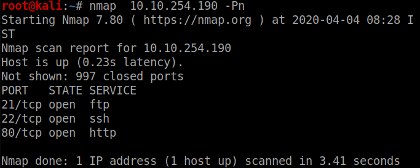
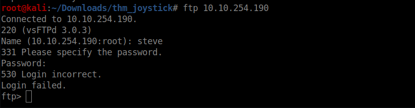
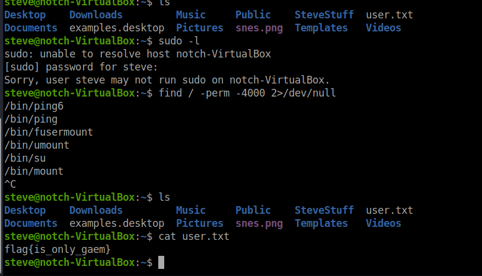

<!--more-->

Let me tell you first the is one of the easiest rooms if you are a beginner on Try Hack ME

Lets start with the nmap scan

Lets checkout port 80 

So lets try ftp with username **steve**

No Success,

LEts try ssh bruteforce using hydra (because ftp bruteforce was taking time 
and I got the user creds for ssh while the ftp one was still running)

So we go the password and lets login

So we got our user flag and running linPEAS showed that we had read access to root.txt
so no need for any privesc simply read the flag

THis room was completed in mere 15 minutes so I couldn't believe myself but it is what it is 

Another one completed 

<b>
Happy Hacking!!
</b>