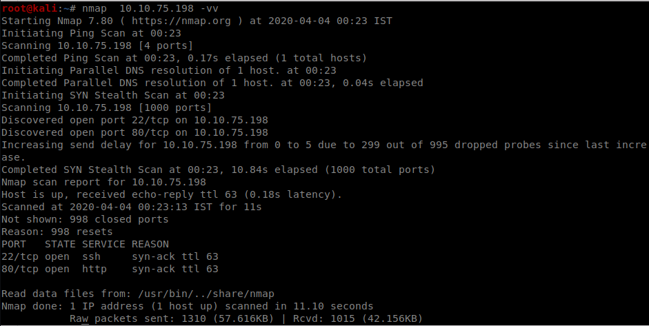
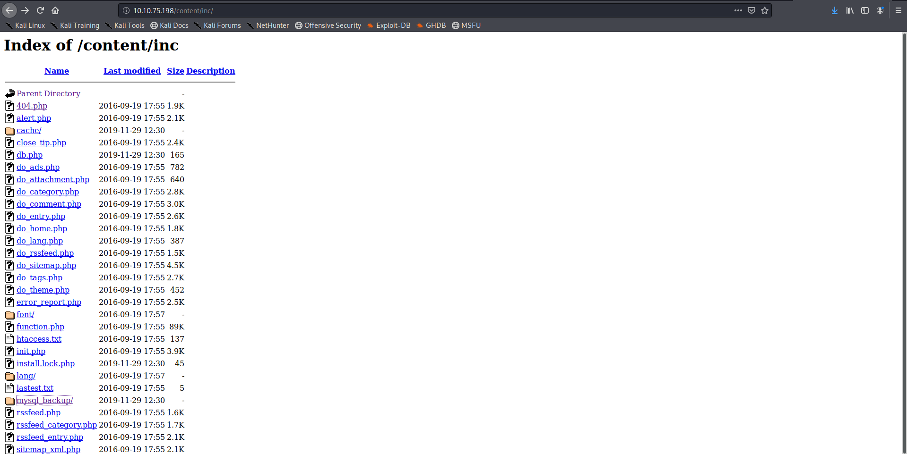
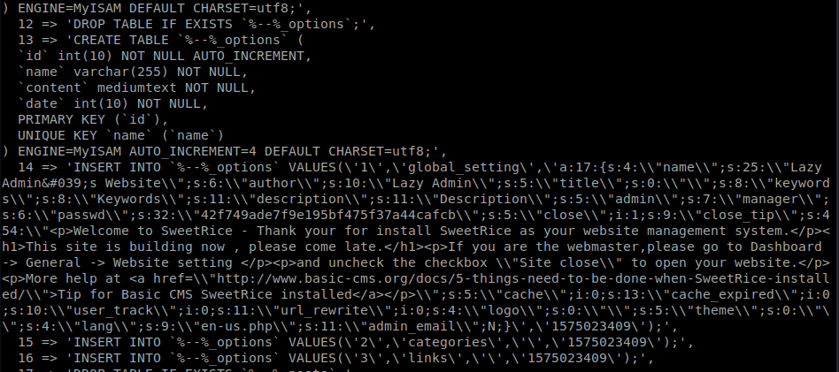
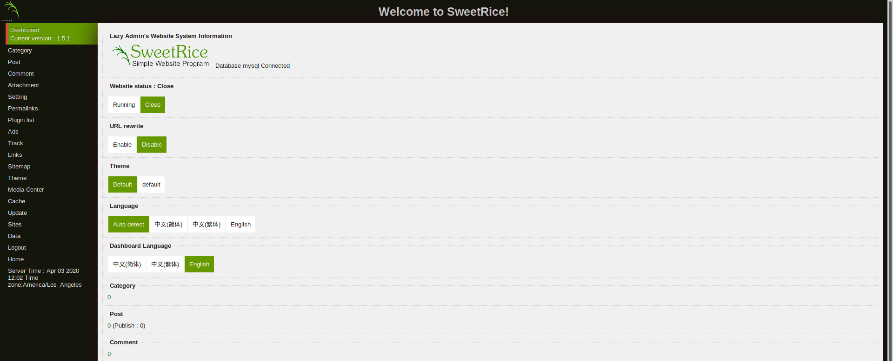

<!--more-->

So lets nmap scan the IP 

Nothing peculiar lets try gobuster for hidden directories

SO the **content** directory seems interesting lets check it out

So it looks like the machine is running sweetRice CMS
lets enumerate the content directory using gobuster

The **inc** directory seemed interesting 
on accessing it there was a folder named mysql backup present there so lets
view its contents

So we get the admin credentials in the mysql backup file

the hash was cracked easily using crackstation

lets login into the cms and see what can be useful

on searching through web for rce in the cms it seemed that we can publish  ads
So we used the php-revshell and posted the ad online

the uploaded file can be accessed from the inc folder so we access it and get the shell

we get the user flag from the home folder

So on checking for sudoers we get that we can use perl as root

So i changed copy.sh to spawn a reverse shell(use pentestmonkey for help)
and execute the perl script as root and got the root shell and found the root flag 

We can also user other ways but this was the way I used to get root 

<b>
Keep Enumerating!!
</b>
