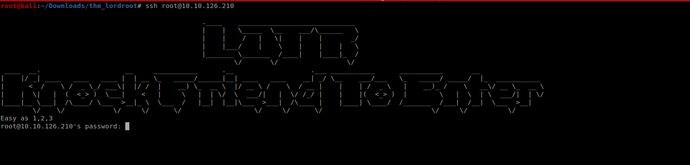
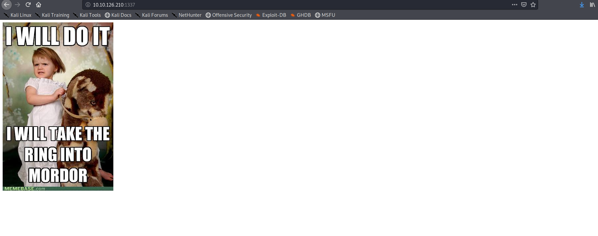
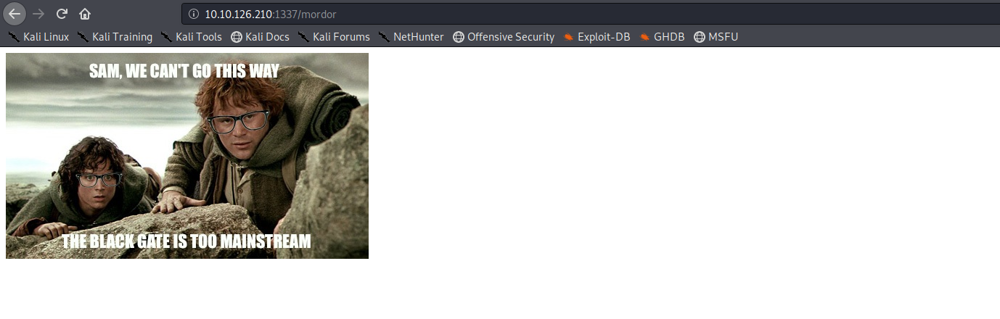
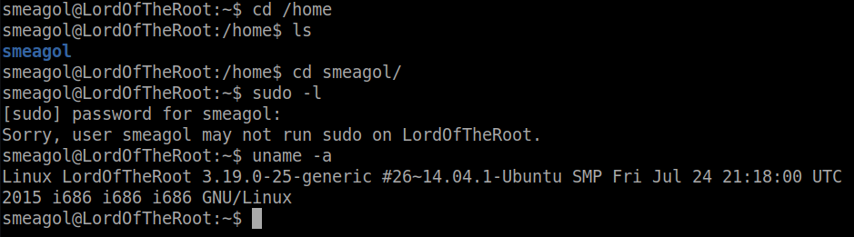

<!--more-->

Lets start with the nmap scan 

accessing 1337 dosn't give us anything 
lets try accessing ssh as any random user

SO it looks like we need to knock the port to access the 1337 port 
use any knock script from github to do this 
I am not showing that 

Lets look at the newly opened 1337 port

I knew that there would be a directory named **mordor** as this machine was related to lord of the rings on accessing it I got a base64 strings lets decode it

I know this is kind of random but sometimes **reading books** helps you :)

you can always find the directories using gobuster

the source:-

So its a hidden php login form ,capture the login request and use sqlmap to get the user creds

by using hit and trial we get login success with smeagol

DOing some recon we see that the linux version is very old there must be some vulnerability related to it
so exploitdb gives us the vulnerability which can be used to escalate permissions to root so 
lets compile and run the exploit to get the flag

THis room was solved due to a bit of luck bit it was fun 
there are other ways of escalating privilages if you want that plz comment below

<b>
Happy Hacking!!
</b>