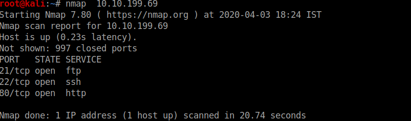
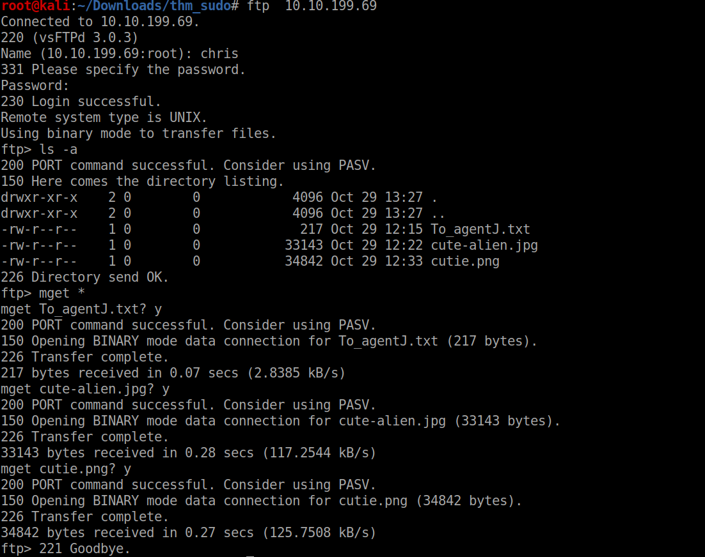
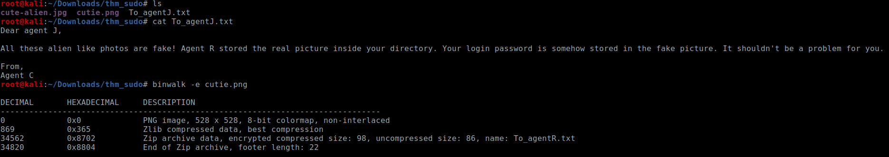
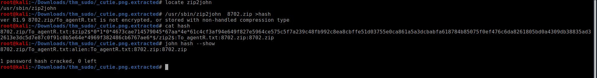
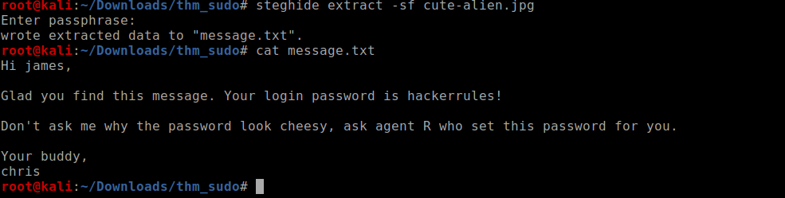
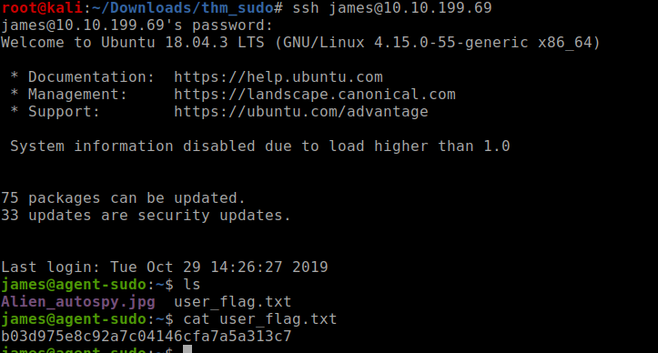

<!--more-->

Lets start with the nmap scan

nothing odd lets access port 80

looking at the message looks like something to do with user-agent

On trying as **Agent A** I get the following response,I am not going to show you all the alphabet responses,**C** get us something interesting

lets look at ftp with username chris and blank pass

lets take a look at the files we have got

SO after reading the note its sure that its a steganography problem
very easy ,you just gotta know the right tools

lets crack the 7z with john

on reading the message ot seemed like base64 

What to do with "Area51", then i remembered that we have a jpeg image as well lets try steghide and we get the user password

I also cracked the password for chris but it was not needed 

checking the home directory of chris gave us nothing but a ugly photo of some alien
lets login as james and get the user flag

the sudoers file had interesting stuff looking at the google gets us a priv esc vulnerability

Exploit Db:- 

so lets privesc and get the flag!!

It was one of the easy privesc as nothing to change just one line of code

<b>
Keep Enumerating!!
</b>