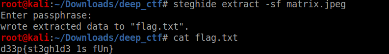
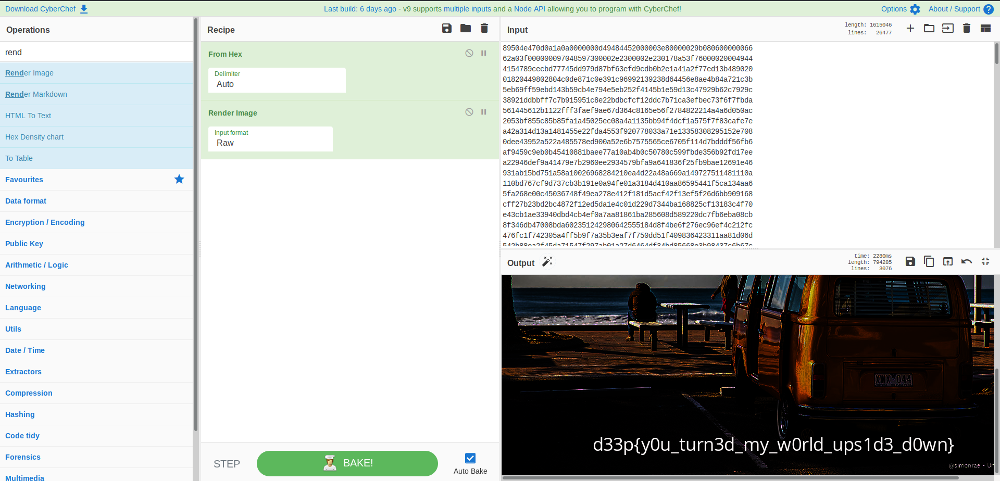

---

layout: post
title: D33P CTF 2020 Writup
description: "Just a simple ctf writup"
date: 2020-04-04
feature_image: images/d33p_0x1/front.png
tags: [CTF, Forensics, Scripting, Crypto]
published: true

---

<!--more-->

Well This was my first ctf with my newly formed team 
## Bat Squad
Our standings

This post will mostly contain the forensics writups so Plz bare with me

### Name:- Warmup
### Points: 50

so we got a jpeg here lets see what strings  shows

hope you got the flag??

### Name:- findme
### Points: 90

So this is also a jpeg 
Strings doesn't give us anything
lets use steghide
what about password???

**Remember**
Read the challenge description carefully

Indeed the author name is passphrase

### Name:- MindYou
### Points: 90

So it provides us with a zip file 

so its a png image opening it gives us a headache

***its corrupted ***

lets check hex

so lets fix the magic bytes and get the flag *EZ_PZ*

### Name:- Cr4ckm3
### Points: 120

So we got a pdff file and a zzip so lets check the pdf because I said so

its password protected ,no probs pdfcrack to the rescue

Read the file properly dont be lazy copy it to a blank txt file

from here on its easy just stay calm 

### Name:- Cr4ckm3(v2)
### Points: 150

I can't show you the txt file given here as the writup would be 100 pages long 

you just need to know that it is base64 encoded text lets use cybechef as nobody want to do forensics manually its always about finding the righty tools

Interesting 
We got a qr it gives us the link

https://v.ht/passis1r0k

See the ur carefully there is something important in it

lets download the zip first

If you cant find the password for zip read my writeup once more

### Name:- deepDive
### Points: 250

We get a pdf file 
on viewing there is no hidden text
lets view it raw in sublime text 
there is an interesting hex string there in all the mess
it starts with the magic bytes of a png lets see it in cyberchef

Hope you got your answer

### Name:- C0rrupt3d Image
### Points: 250

So the txt  file is a hex string looking at its end I find some bytes matching to the png file header so I reverse the string and view it 

So the first four bytes are courrupt them 
Easy!!
Replace them with png file signature and get the flag

### Name:- b0ss Obs3rv3r
### Points: 500

For this challenge I can't take credit alone my team mates scripted the observation for me
and We got the flag
As the challenges says I am the **boss observer**
but very ***lazy***

lets start 
on viewing the pcap in wireshark i see there is lot of dns packets ,first clue

all the dns packets had ??.d3v1l4l.com in it the first two letter were changing too frequently so as to have a steady connection , second clue

and the start dns packet had the magic bytes of png file, third clue

From here onwards its clear scripting problem

you can use tshark or use regex 

I will show you the final png

That's it for forensics, do comment if you want any other writups

<b>Go Corona ,Corona Go</b> 
 

<b>Stay Safe</b> 
