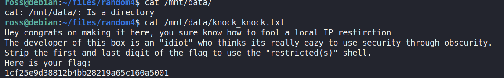
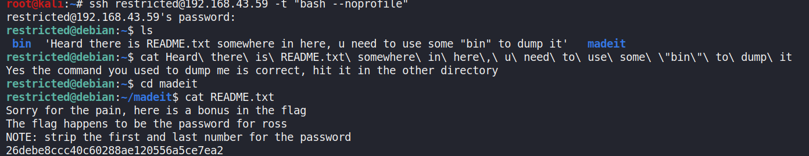
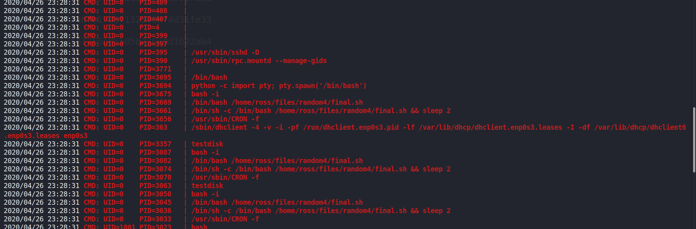
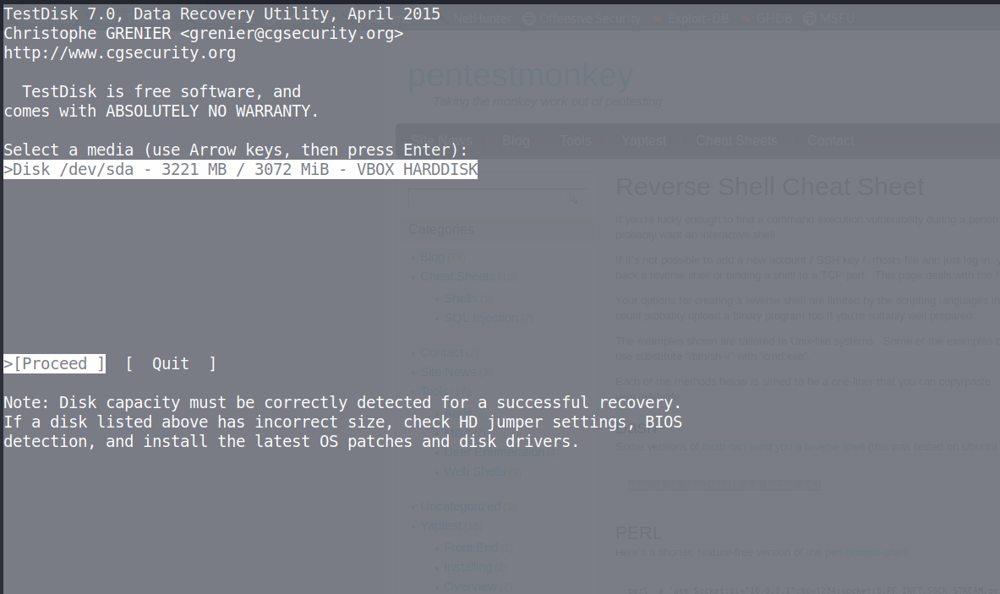
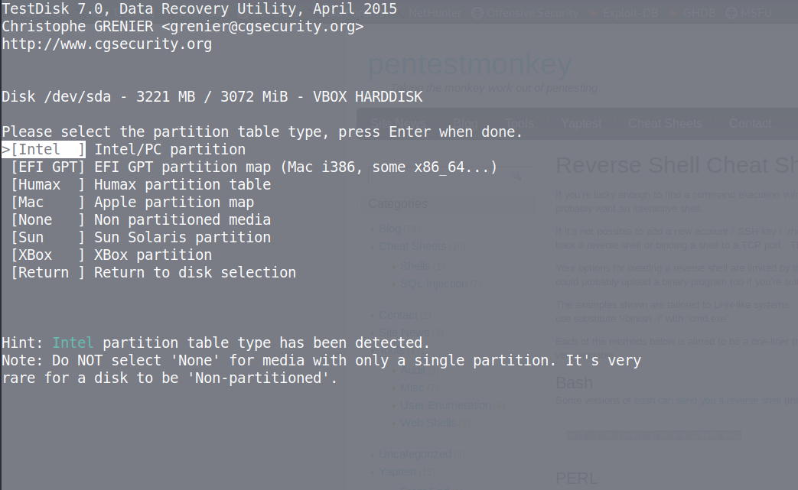
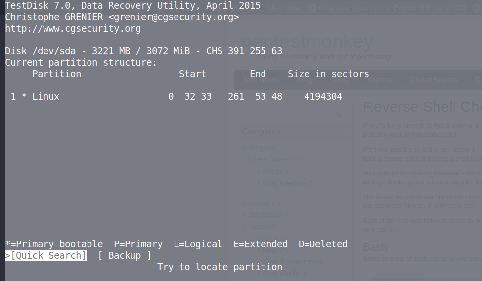
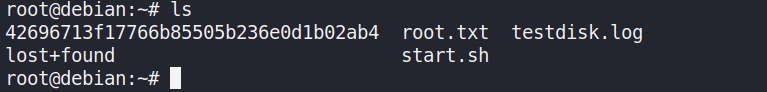

---

layout: post
title: IJCTF Boot2root  Writup
description: "Just a simple ctf writup"
date: 2020-04-26
feature_image: images/ijctf_boot2root/front.png
tags: [CTF, boot2root]
published: true

---


<!--more-->
# Flag 1

ok so lets start with the obvious
```netdiscover```

as we don't know the machine ip


following up with the nmap scan


interesting so we have nfs open
lets check if there are any folders to share


So now the process was very simple the box had 2 nic one to use for NAT and other for host-only adapter
So we need to configure host-only adapter ip according to the ip specified to ***Fool the box*** as the challenge name suggests

A useful [guide](https://www.tecmint.com/network-between-guest-vm-and-host-virtualbox/) I found on the internet
I did not use the 2 nics but i should have :(

Anyways using mount command we mount the folder and read the flag1
I am attaching the screenshot of the same file from inside the box i wanted to prevent the unnecesary pain of changing adapters




# Flag 2

This was the flag that suprised me a the most 
trying to login as **restricted**

As the name suggest and shown below its a restricted shell


after try all the commands I know on linux i read this [article](https://www.hackingarticles.in/multiple-methods-to-bypass-restricted-shell/) which turned out to be very useful

I got a normal shell as shown below and the README.txt file was very hard for me to guess as the I couldn't use ```ls``` in madeit directory 
anyways got it after 2-3 hours of brainfuck



# Flag 3
This was one of the main flag that made me go crazy
I got a lot of help from the admin on this
I ran ***linPEAS*** but got nothing 
Then the author told me to use pspy64 
this turned out to be tool that looked for hidden cronjobs 
and it showed thatf **final.sh** was being run as root



And since final.sh was root only read-write I could do nothing
Once again the great admin came to my rescue :)
He told me to see permissions of ross's home directory
so it seems that **files** directory had ross as the group so we could modify it 
this means that we can make a new final.sh with same path and revshell in it to get the root shell


We got the root flag as well atlast :)))))


***Note:I got flag 4 after the ctf was over***

# Flag 4
**NOTE**: Stabilise the shell before doing anything

the hint was about forensics tool;
what can be the tools with disk image
volatility --> NOOOO
testdisk --> YES
 
SEE the following images to see the steps I followed to get the final flag!!
<br>

<br>


<br>


<br>


<br>


<br>


press **p** to list files


keep pressing *c* until you get something like shown below


there is the final flag for you !!



if you have any doubts ping me up on **Discord**!!


