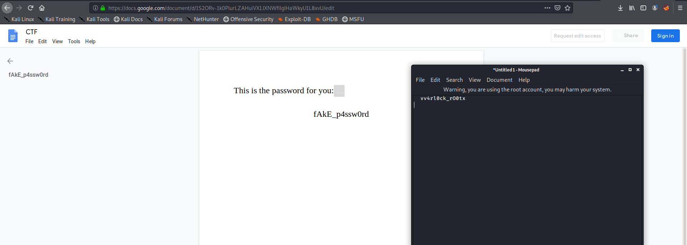

---

layout: post
title: IJCTF Forensics  Writup
description: "Just a simple ctf writup"
date: 2020-04-28
feature_image: images/ijctf_forensics/front.png
tags: [CTF, Forensics, Volatility]
published: true

---


<!--more-->
# Challenge 1

## Name-Simple Raw

Lets start with basic imageinfo command


Its is windows 7 lets continue further see the process list


```bash
root@kali:/media/sf_kali_share/chall1# vol.py --plugins=plugins/ -f chall1.raw --profile=Win7SP1x64 pslist
Volatility Foundation Volatility Framework 2.6.1
Offset(V)          Name                    PID   PPID   Thds     Hnds   Sess  Wow64 Start                          Exit                          
------------------ -------------------- ------ ------ ------ -------- ------ ------ ------------------------------ ------------------------------
0xfffffa8003c74b30 System                    4      0    106      557 ------      0 2020-02-28 04:32:16 UTC+0000                                 
0xfffffa80044ffb30 smss.exe                272      4      2       32 ------      0 2020-02-28 04:32:16 UTC+0000                                 
0xfffffa8004630630 csrss.exe               364    348      9      616      0      0 2020-02-28 04:32:17 UTC+0000                                 
0xfffffa80054d1060 wininit.exe             416    348      3       77      0      0 2020-02-28 04:32:17 UTC+0000                                 
0xfffffa80054d06a0 csrss.exe               424    408     11      222      1      0 2020-02-28 04:32:17 UTC+0000                                 
0xfffffa80054ff060 winlogon.exe            472    408      5      119      1      0 2020-02-28 04:32:17 UTC+0000                                 
0xfffffa800552ab30 services.exe            524    416     12      250      0      0 2020-02-28 04:32:17 UTC+0000                                                                  
<---REDACTED---->
0xfffffa8005d60360 SearchIndexer.         3016    524     15      635      0      0 2020-02-28 04:32:39 UTC+0000                                 
0xfffffa8005dd2b30 wmpnetwk.exe           2204    524     14      455      0      0 2020-02-28 04:32:40 UTC+0000                                 
0xfffffa8005e25750 SearchProtocol          724   3016      7      227      1      0 2020-02-28 04:32:40 UTC+0000                                 
0xfffffa8005e9eb30 svchost.exe             284    524     12      359      0      0 2020-02-28 04:32:41 UTC+0000                                 
0xfffffa80060ab5b0 **chrome.exe**             3716   2496      0 --------      1      0 2020-02-28 04:33:03 UTC+0000   2020-02-28 04:34:06 UTC+0000  
0xfffffa80060e15e0 sppsvc.exe             1120    524      5      163      0      0 2020-02-28 04:34:19 UTC+0000                                 
0xfffffa8005f29060 svchost.exe             640    524     16      339      0      0 2020-02-28 04:34:19 UTC+0000                                 
0xfffffa8004055950 WmiApSrv.exe            348    524      7      123      0      0 2020-02-28 04:34:58 UTC+0000                                 
0xfffffa8005a6d730 DumpIt.exe             4004   2496      5       51      1      1 2020-02-28 04:35:09 UTC+0000                                 
0xfffffa8005f50060 conhost.exe            4012    424      2       51      1      0 2020-02-28 04:35:09 UTC+0000                                 
0xfffffa80059d9a90 SearchFilterHo         3912   3016      5       24 ------      0 2020-02-28 04:35:40 UTC+0000
```

So here the chrome browers was open in the image so lets check the chrome history using volatility plugins


on visting the [link](https://docs.google.com/document/d/1S2ORv-1k0PlurLZAHuiVX1JXNWfilgIHaWkyU1L8xvU) we get a doc ,
it does not show anything specifically but on downloading and copying all content and viewing in notepad we get this 



password = **vv4rl0ck_rO0tx**

Seems like password lets search for archives using filescan
this file looked interesting


```bash
0x000000013de7ec20      2      0 RW-rw- \Device\HarddiskVolume2\Users\Bin\Downloads\94lf.rar
```


lets extract the rar file using dumpfiles volatility


# Challenge 2

## Name-List Of File Type


lets scan for processes

```bash
root@kali:/media/sf_kali_share/for2# vol -f for2.raw --profile=Win7SP1x64 pslist
Volatility Foundation Volatility Framework 2.6.1
Offset(V)          Name                    PID   PPID   Thds     Hnds   Sess  Wow64 Start                          Exit                          
------------------ -------------------- ------ ------ ------ -------- ------ ------ ------------------------------ ------------------------------
0xfffffa80018b05f0 System                    4      0    102      513 ------      0 2020-04-16 11:17:32 UTC+0000                                 
0xfffffa800300a040 smss.exe                280      4      5       30 ------      0 2020-04-16 11:17:32 UTC+0000                                 
0xfffffa8003af8060 csrss.exe               380    360      9      545      0      0 2020-04-16 11:17:33 UTC+0000                                 
0xfffffa8003da08a0 wininit.exe             424    360      7       92      0      0 2020-04-16 11:17:33 UTC+0000                                 
0xfffffa8003da7380 csrss.exe               448    432      9      234      1      0 2020-04-16 11:17:33 UTC+0000                                 
0xfffffa8003de4350 winlogon.exe            496    432      7      124      1      0 2020-04-16 11:17:33 UTC+0000                                 
0xfffffa8003dec220 services.exe            516    424     18      242      0      0 2020-04-16 11:17:33 UTC+0000                                 
0xfffffa8003e014c0 lsass.exe               548    424     12      644      0      0 2020-04-16 11:17:33 UTC+0000                                 
<-------REDACTED------------------>
11:17:54 UTC+0000                                 
0xfffffa8004c9db30 WmiApSrv.exe           2300    516      7      119      0      0 2020-04-16 11:17:55 UTC+0000                                 
0xfffffa80031c0060 **TrueCrypt.exe**          2488   2288     16      480      1      1 2020-04-16 11:17:57 UTC+0000                                 
0xfffffa8002437b30 DumpIt.exe             2372   2288      2       47      1      1 2020-04-16 11:18:28 UTC+0000                                 
0xfffffa800320cb30 conhost.exe            2124    448      2       52      1      0 2020-04-16 11:18:28 UTC+0000                                 
0xfffffa8003166720 dllhost.exe            2132    676      6       91      1      0 2020-04-16 11:18:30 UTC+0000
```

the process trucrypt.exe looks useful so lets use the trucryptpassphrase option to get the pass


pass=```d3p_tr4i_4nd_b0_d0i_qu4 ```

lets do filescan ,according to hints we find one wav file and one flag.png file useful from the list

```
0x000000007cdb3d90     16      0 -W-rwd \Device\HarddiskVolume2\Users\Bin\Desktop\flag.pngmp\vmware-Bin\VMwareDnD\e904785e\flag.png
0x000000007cdcc070     32      0 RW---- \Device\HarddiskVolume3\LoiNho-DenVau.wav
```

lets try to extract them 
**NOTE**:use the flag `-u` with the files to get DataSectionObject and SharedCacheMap both as we need the data object to run steghide with 

So most probably wav would be used with steghide to hide a file 
lets search for userpass using hashdump


Lets use crackstation to crack the NTLM hash and the hash for `Bin` user returns success


lets run steghide with the pass as `t0mc4t` and we get a word file


As the file name suggest it must be a truecrypt container files
if you don't know how to setup truecrypt containers here is a useful [guide](https://kenfavors.com/code/how-to-open-a-truecrypt-container-using-cryptsetup/)

we get one more password !!
pass=`k0_b1k_d4t_p4ss_l4_g1`


what could this be for???
maybe for flag.png , lets check the file type it seems to be encrypted using gpg so lets decrypt 
using the password we got

We get the flag finally!! **:)))**


