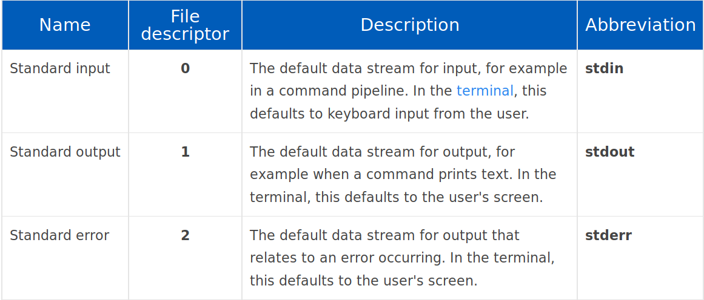
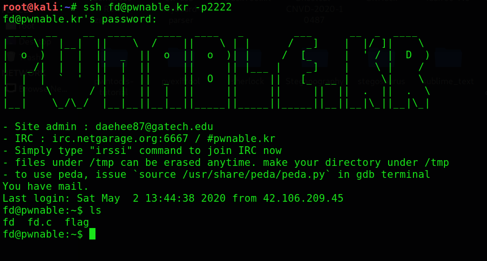
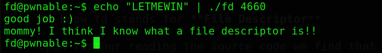

---

layout: post
title: Pwn-A-Day Day-1
description: "Pwn challenges for a Month"
date: 2020-05-01
feature_image: images/pwn_a_day/front.png
tags: [Pwn-A-Day]
published: true

---


<!--more-->

**So I have taken a challenge to this month to do at least one pwn challenge a day for the entire month of May**

# Day1

I started with an easy challenge from this [site](http://pwnable.kr/play.php) as I am completely new with this category 

## Name- fd

the description says to connect to the server using ssh and something about file descriptor lets look it up online
I got this



More about it can be read on this [site](https://www.computerhope.com/jargon/f/file-descriptor.htm)

lets login and see what we got 



So we have a flag , fd binary and its source c file 
lets see the source file 

```c
char buf[32];
int main(int argc, char* argv[], char* envp[]){
        if(argc<2){
                printf("pass argv[1] a number\n");
                return 0;
        }
        int fd = atoi( argv[1] ) - 0x1234;
        int len = 0;
        len = read(fd, buf, 32);
        if(!strcmp("LETMEWIN\n", buf)){
                printf("good job :)\n");
                system("/bin/cat flag");
                exit(0);
        }
        printf("learn about Linux file IO\n");
        return 0;

}
```

Intially lines shows that we need to pass 2 arguments for the program to run 
Further it determines the value of fd using the following logic:-
` fd= atoi(argv[1])-0x1234 `

atoi function converts a string to integer 

We know fd stands for **File Descriptor**

Upon furthur reading the source code we find that we need to pass the string `LETMEWIN` to stdin so as to get the shell so lets see what we got here 

For stdin fd is 0 so we need to supply *argv[1]* equal to 0x1234 so as to get the value 0 
and then enter  the string  to get the flag!!
The full solution is shown below



