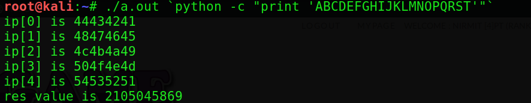
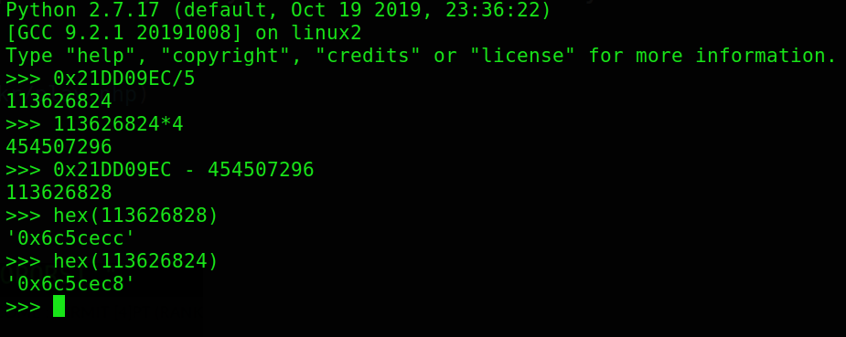
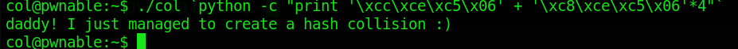

---

layout: post
title: Pwn-A-Day Day-2
description: "Pwn challenges for a Month"
date: 2020-05-02
feature_image: images/pwn_a_day/front.png
tags: [Pwn-A-Day]
published: true

---


<!--more-->

**So I have taken a challenge to this month to do at least one pwn challenge a day for the entire month of May**

# Day2

This is the 2nd easy challenge from this [site](http://pwnable.kr/play.php)  

## Name- Collison

We are given with flag,binary and the source code of binary 
Lets view it!

```c
#include <stdio.h>                                                                  
#include <string.h>                                                                 
unsigned long hashcode = 0x21DD09EC;
unsigned long check_password(const char* p){
        int* ip = (int*)p;
        int i;
        int res=0;
        for(i=0; i<5; i++){
                res += ip[i];
        }
        return res;
}

int main(int argc, char* argv[]){
        if(argc<2){
                printf("usage : %s [passcode]\n", argv[0]);
                return 0;
        }
        if(strlen(argv[1]) != 20){
                printf("passcode length should be 20 bytes\n");
                return 0;
        }

        if(hashcode == check_password( argv[1] )){
                system("/bin/cat flag");
                return 0;
        }
        else
                printf("wrong passcode.\n");
        return 0;
}
```

SO its turns out to be some kind of hash checking thing
lets view the check_password in detail

Since I didn't understand what it did I decided to print each value the function processed 
This is my modified source code

```c
#include <stdio.h>
#include <string.h>
unsigned long hashcode = 0x21DD09EC;
unsigned long check_password(const char* p){
        int* ip = (int*)p;
        int i;
        int res=0;
        for(i=0; i<5; i++){
                printf("ip[%d] is %x \n",i,ip[i]);
                res += ip[i];
        }
        printf("res value is %d \n",res);
        return res;
}

int main(int argc, char* argv[]){
        if(argc<2){
                printf("usage : %s [passcode]\n", argv[0]);
                return 0;
        }
        if(strlen(argv[1]) != 20){
                printf("passcode length should be 20 bytes\n");
                return 0;
        }
        check_password(argv[1]);
        return 0;


}
```

Now I compiled the binary and saw the output
The output showed that the 20 bytes supplied are broken down into 5 parts and their values are added and checked with a specific hex value 




so we need to break that given hex value into five parts
which is shown below




the complete solution is given below
**NOTE**:-Little endian format is used



