---

layout: post
title: zh3r0 Ctf Writups
description: "All master challenges solved by me"
date: 2020-05-07
feature_image: images/zh3r0_ctf/front.png
tags: [CTF,Forensics]
published: true

---


<!--more-->

So in this I will solve all the Master Challs

## Name - Are you the Master? 0

So we are given with a broken image ,lets fix it

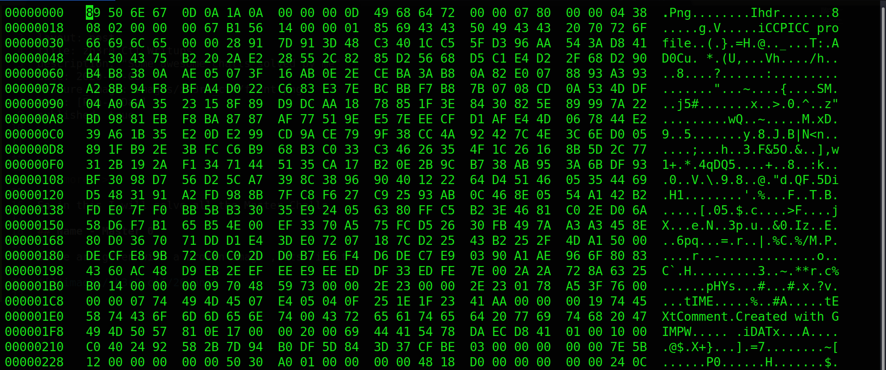

here you can see that ``` png, ihdr, idat ``` chucks are improper they need to be all capital even `Iend` chunk was also corrupt so we fix all of them

finally should look somethiing like this

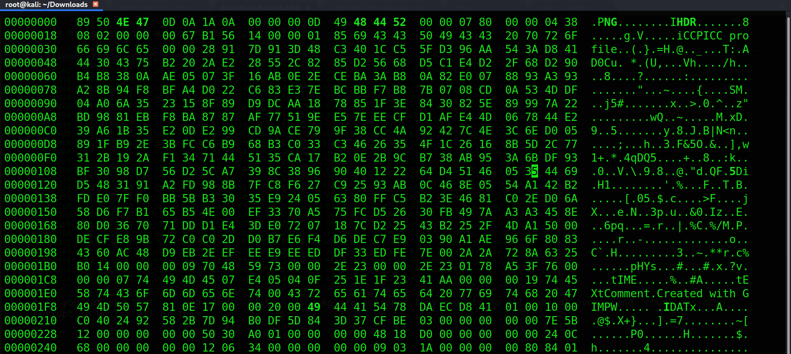
 
it should now be able to open and look like this!


while fixing we see that there is a link included in the end of the image 
<tinyurl.com/y7kfm58j>

visiting the link gets us the flag.bps file , I searched for it online and found that this file was used to patch the game roms with some super awesome hacks!!

Next I looked if there are any past ctf questions related to this bfs file and yes there was a very recent question from **WPICTF** this the link to [writeup](https://aadibajpai.com/blog/p/ttL4fYDn.html) that I found most useful 

I downloaded the Floating IPS software for windows and tries patching the image with the bfs file given it gave error ,
I asked author wether the image was corrupted or anything
then skip to 12 pm on 6-may there was a hint released that we need to remove the trailing bytes before patching so i wrote a quick and ugly python script to remove the bytes 

NOTE- `42 60 80` are the ending bytes of png

```python
f=open("final.png","rb")
data=f.read()
f.close()

print hex(ord(data[0x235b]))
# for i in data:
	# print ord(i)

data=data[:0x235b]

print hex(ord(data[-1]))

fl=open("final_patch.png","wb")
arr=bytearray(data)
fl.write(arr)
fl.close()
```
after that we try to patch and its a success so we got the flag

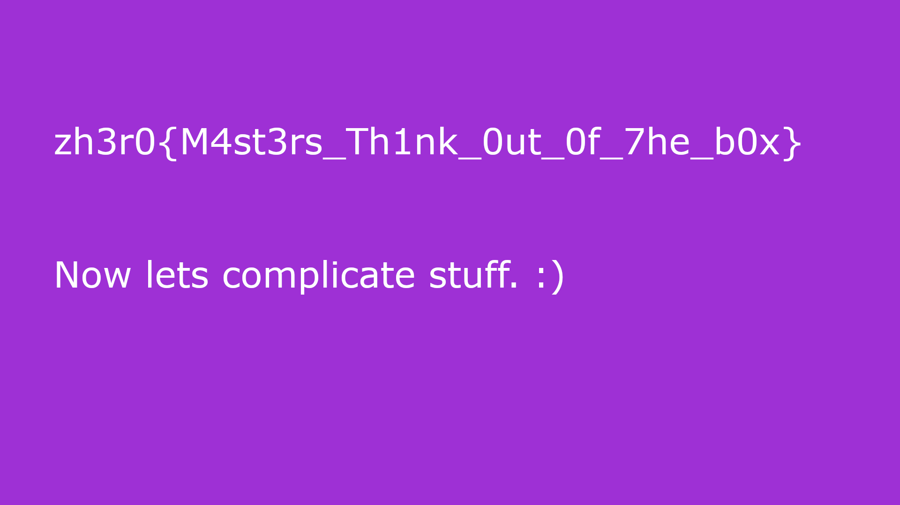

Moving on to next chall

## Name - Are you the Master? 1

here we are given with a website, nothing special

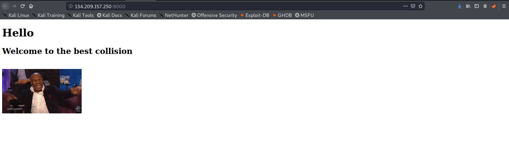

Seeing the word collision hinted me that there must be some type of hash collison related to php

SO I check the source code

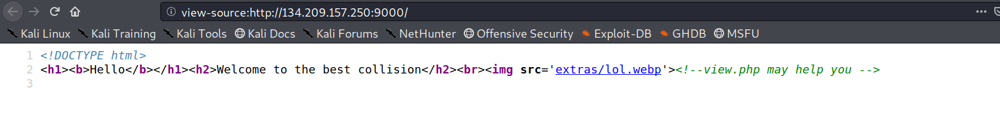

hint to visit view.php
lets see what we have there

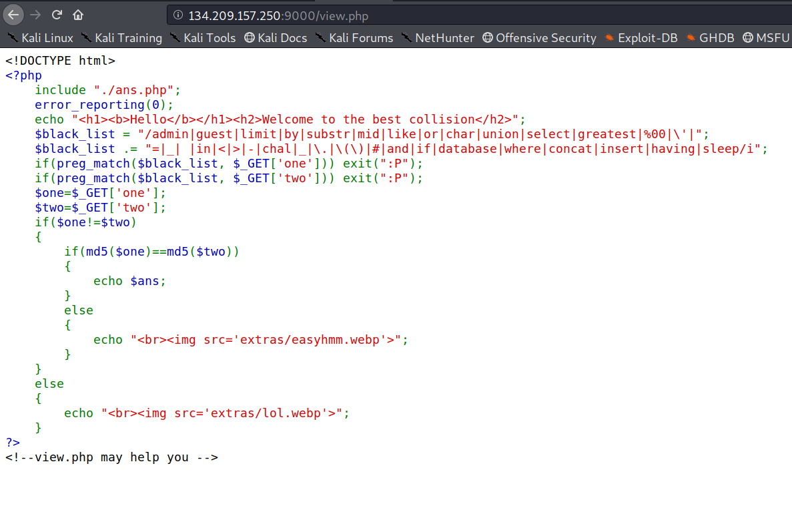

SO we have a source code for the page;
SO we have 2 parameters ; **one** and **two**

we have to supply such arguments that the condition ```md5(one)==md5(two)``` returns true so we get the ans

So I had a repo bookmarked which had  some very useful things related to php hash collision
this is the [link](https://github.com/spaze/hashes)

visit the md5 section and take the first two strings as the one and two

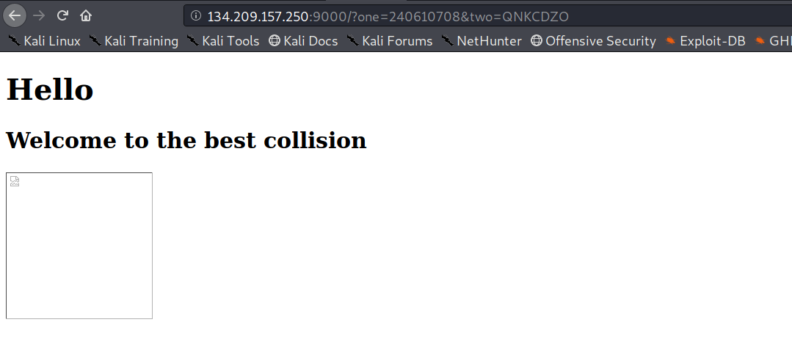

strange the gif is not available ,lets check the source


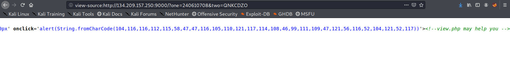


these look like ascii chars so we move to cyberchef and it automatically suggests the conversion

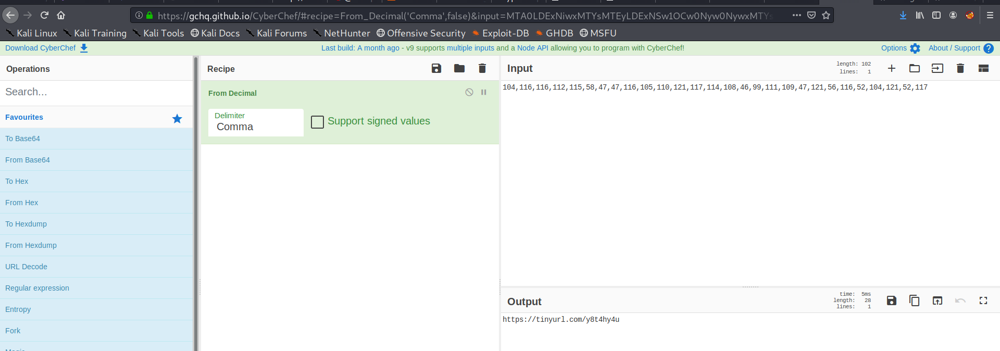

we get the url and submit that as a flag!!

## Name - Are you the Master? 2

So for this we are given a python file and RSA.txt
SO the file logic was simple We are given N1,N2 , e, Ct1,ct2
and there was also a file we get from the drive link that we have from previous challenge 

C=p+q+r+s
D=(p-q)-(r-s)

SO this was a maths problem not a rsa one 

I will share my some very clumsy notes as to how I figured it out

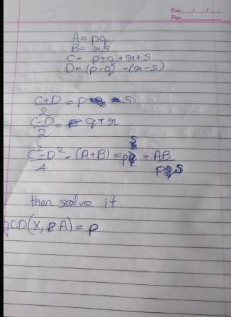

this is my script 

```python
from sympy import Symbol,solve
from Crypto.Util.number import *

A=12417127080422815737857829178789430387283644656796286644007190181275233038254982650900520208444570033944895679971951177467573644862800675887334791773359856548963510883567782247183009990733340366515218860231712518296231805253324709898640633155086183815927550133617562353243937514697745005568701059532650134387938324758897250094164121081436717576172349562189353547255742022806306628952658668123205041188480195366849528415075164756192945905158788561605088805110011605401289098591967818721785957410628314905762182529466041792601801094942412062721024595217699250282503561387690942463365022141266614422371304745947051066911
B =13535742671170343194649874173445485003326954678704056429640294829224266409224232171669448606741290104143837444968157218953588036492336055641208728870300040922937631422614960829636268967870984021444065500833099886484031433400395173560484969029637105065058222908335510602204222935794203521997891554881452372380306145071165640328082610889602712719130949436394915102917587068497410741572114811122786488523349899125527219920591403522973523980874897487583741525542325853756358317440225706520923430697121297492167491992231025785528653319733872313411135278109820094900710129215353037113925434816021050732043191473976761644041
E =65537
ct1 =3776478243125222658515594635416338601627622074381925747470047865965623614236065341693278202724655814789048471523954172003395524166507583326259250957544858846929239564248292316635638398557784195461238822667662560834324258193103655795748902328797091392483535364256029591727235692999622720632986889258592903607027869408557025837341680731133831338187240101119708022782009249576510526966551941049438189519877273072953206086848387281968052298929142667413389464722377867077939780430741421774157426130552850296605612726411410208158788106389052244165013174051754347396411043231017624630314985276556512095367376194166983202656
ct2 =7471105302033726624348179056006102001743809379610790495990361582195962520557700698227064129651085739444191028128176147799489919280009589425849137820372420135939769088821576342640623082390932818443391879503480878338988874515465135748696786393981595338231697778807840380832581402247957280502420865619136723005390412129347650962993340216276467370740315070335165120909896658177064874807505548978408902050051164653353998354606171833454089175369272182111944006829304667049184048735602475682713286708285884830794825232745110283703967477544785484740070361288801304990780610865735344998099533276936639966965167506352214073254

#p+q+r+s
C=461865358514192960434982980388049288328080532500468524967649213492976854354009981587975391303842169821869139144259614711715053619184463738325803100173566859332560510654710569094589524171402215115591813322237293103273306369558719284046155313287463229499747397470701965008926099021198426250727264745924621147722
#(p-q)-(r-s)
D=72904645555375913591333808068681895072188978607726716983118482918641130003107637360771239343328911228636046234796389775690478441161899404683856843572593683704394524558615891086457573500744380638740361933791300531356267210630868457364050727161034745914546893554710104131439008766029508068850386010386259775806


t1+t2=A+B+2-C

prod=(C**2-D**2)//4-(A+B)


x=Symbol('x')
sol=solve(x**2-prod*x+A*B,'x')

X,Y=sol[0],sol[1]

p=GCD(X,A)
r=GCD(X,B)
q=GCD(Y,A)
s=GCD(B,Y)

tot1=(p-1)*(q-1)

tot2=(r-1)*(s-1)

d1=inverse(E,tot1)
d2=inverse(E,tot2)

m=pow(ct1,int(d1),A)

print(long_to_bytes(m))

```

this gives us the flag

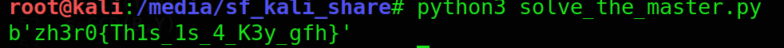

## Name - Are you the Master? 2

So here the drive provide us with a iv binary and img.txt

So opening up the binary in ghidra showed nothing ,it was just to print the strings ,"Its a string"
Upon reading the message i got that i have to run the strings on binary 

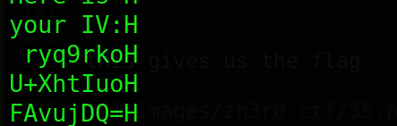

NOTE- remove the char `H` it seems to redundant
we get our iv

I asked author about the ,key, very dumb of me 
It was the flag from last master chall

now I write a script for AES-CBC decrypt as the cyberchef was not supporting me that day

cipher text is the img.txt

```python
from Crypto.Cipher import AES
import binascii
import base64

key="zh3r0{Th1s_1s_4_K3y_gfh}"
print(len(key))
AES.key_size=192
b64="ryq9rkoU+XhtIuoFAvujDQ=="
IV=base64.b64decode(b64)

decipher = AES.new(key, AES.MODE_CBC,IV)

msg="<REDACTED>"

ct=base64.b64decode(msg)

print(decipher.decrypt(ct))

```

We get a base64 data we deccrypt it and save to file !

we open hexedit and find this!

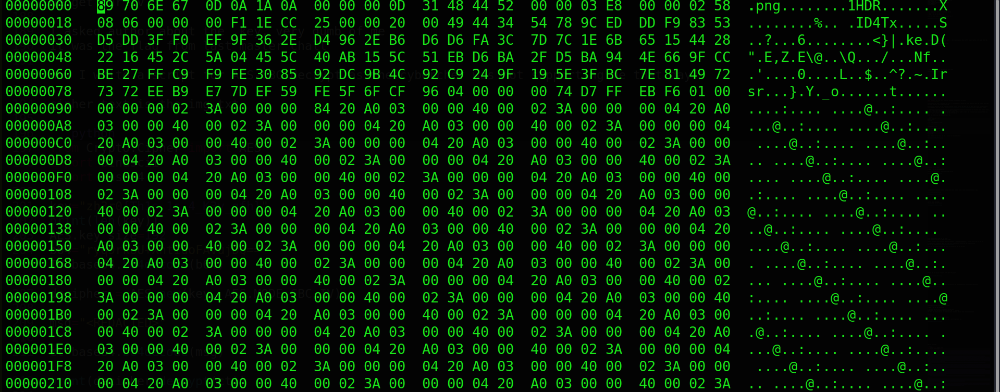

So once again we need to correct headers ,the chucks png ihdr,idat,and iend need to be fixed
fixed image has hex something like this

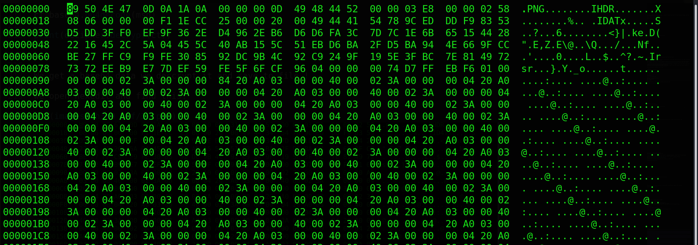

Save this and view the file its now possible to see the flag!

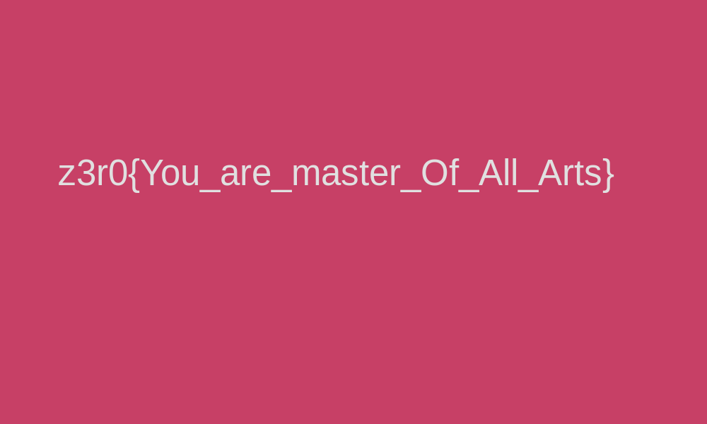

So I thats it for today!!!

Hope you liked it!!!
