---

layout: post
title: zh3r0 Ctf Writups
description: "Some awesome challs solved by me"
date: 2020-05-06
feature_image: images/zh3r0_ctf/front.png
tags: [Pwn-A-Day]
published: true

---


<!--more-->

Lets start with some trivial ones:
they don't need any explanation just a screenshot would explain it all

## Name- Pizza
## Category - Web

See the source code of js file

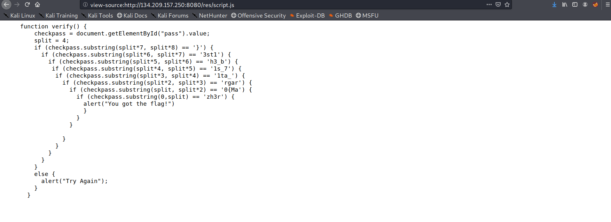

## Name- Cake 
## Category - Web

Always remember to see robots.txt

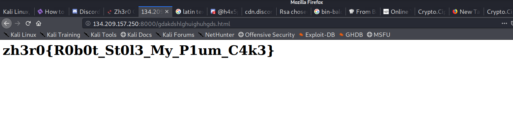


## Name- Tasty Snacks
## Category - Web

The name and screenshot are self explanatory


## Name- Pasta
## Category - Web

See the code
JSFUCK Spotted!!

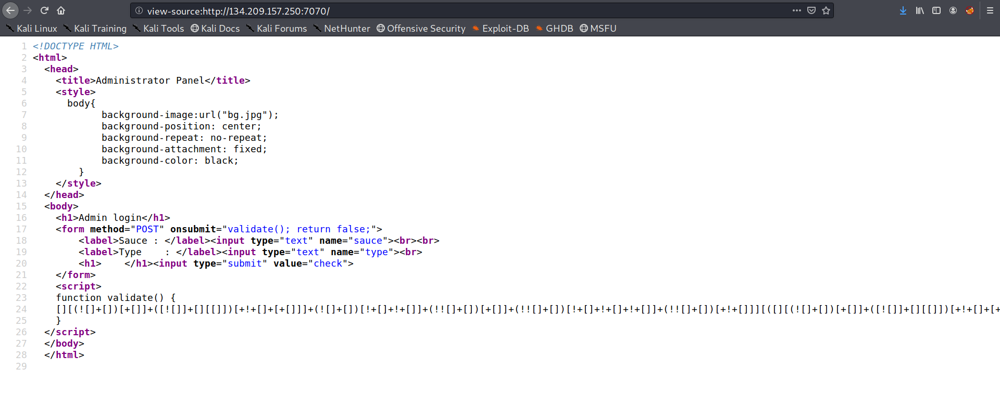

Decode it !!

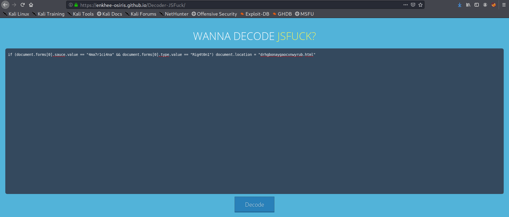

visit the page directly no need to login!!

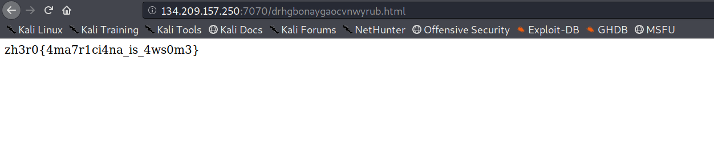

## Name- Ice Cream 
## Category - Web

Ask Finch about it or use the dig in cmdline :)

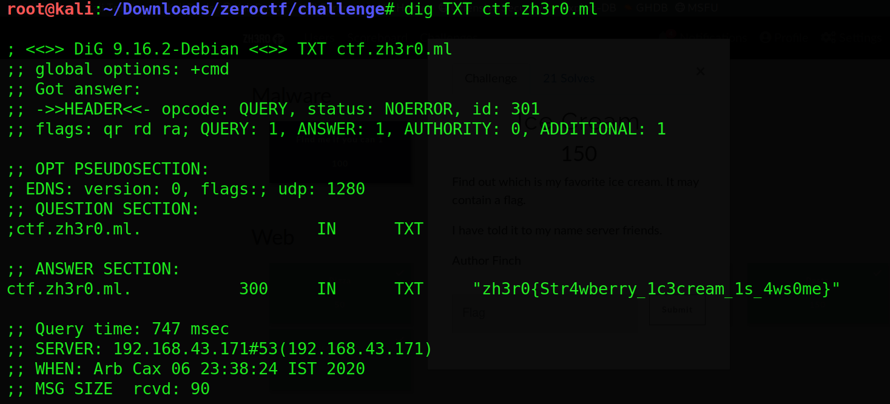


## Name- Rainbow
## Category - Misc

Create a wordlist using the criteria given 

```python
colors =["red", "orange", "yellow", "green", "blue", "indigo", "violet"]
for color in colors:
		for i in range(100):
			print color.upper()+str(i).zfill(2)
```

brute with john using the wordlist generated

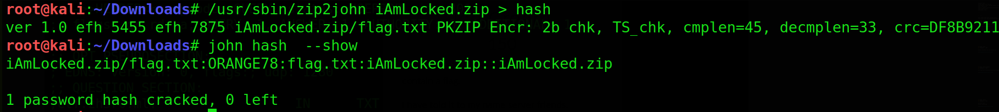

## Name- A mix of Everything
## Category - Misc

Lets start with cracking the zip

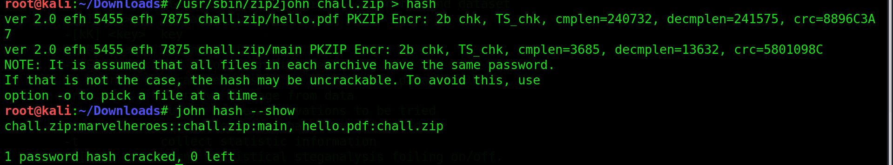

Open the binary in ghidra the `EEEE` function name looks suspicious so lets check it 
we get a strings that is xor with *2*

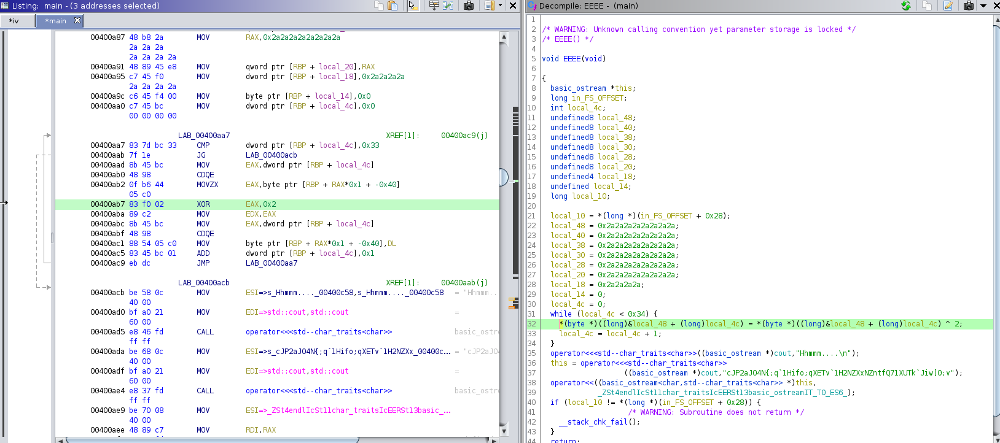

Lets used cyberchef for xor on xor we get base64 string on further decode we get a link to website

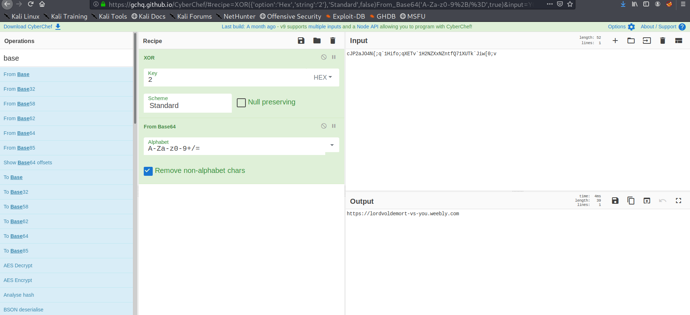

On website we get a base encoded string

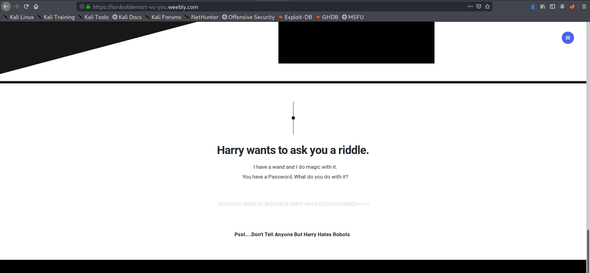

back to cyberchef

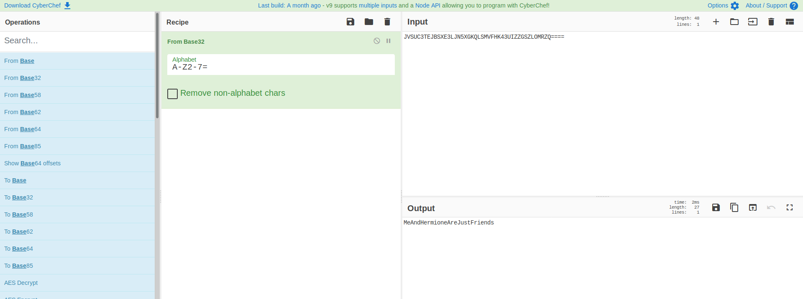

That looks like a password to pdf file lets use it to open pdf
We got a image ,save it!

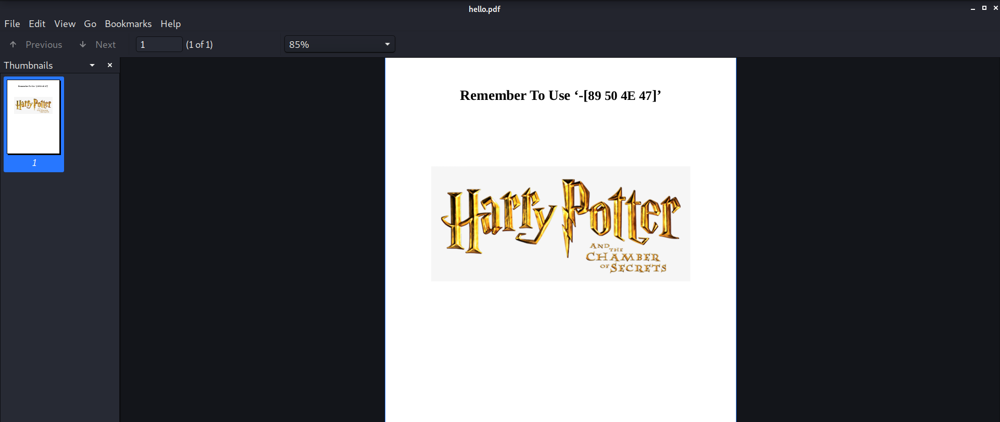

Run zsteg to get the flag!!

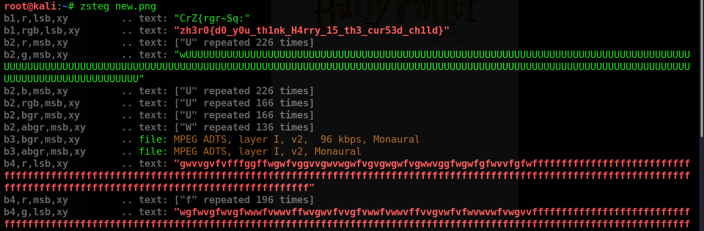

Nice challenge literally a mix of everything!

## Name - Audiona spectorum
## Category - forensics

use any audio tool to plot spectogram and get the flag

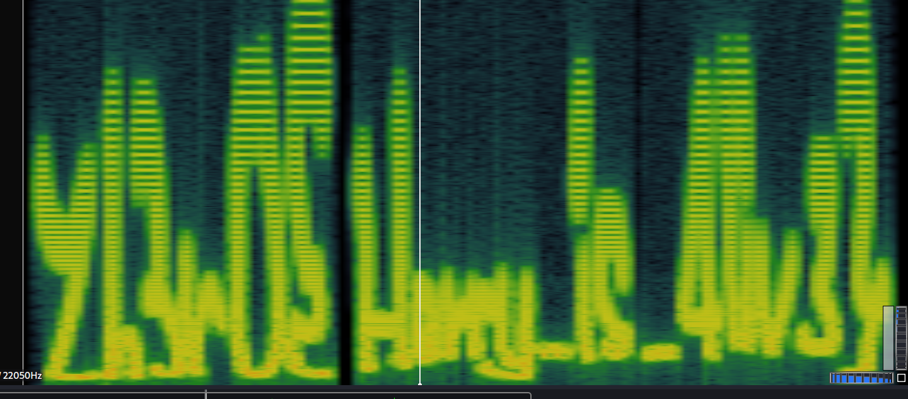

its not clear but works for me

## Name - Mrs.Norris
## Category - forensics

see the exif data of the image we get a base encoded string 

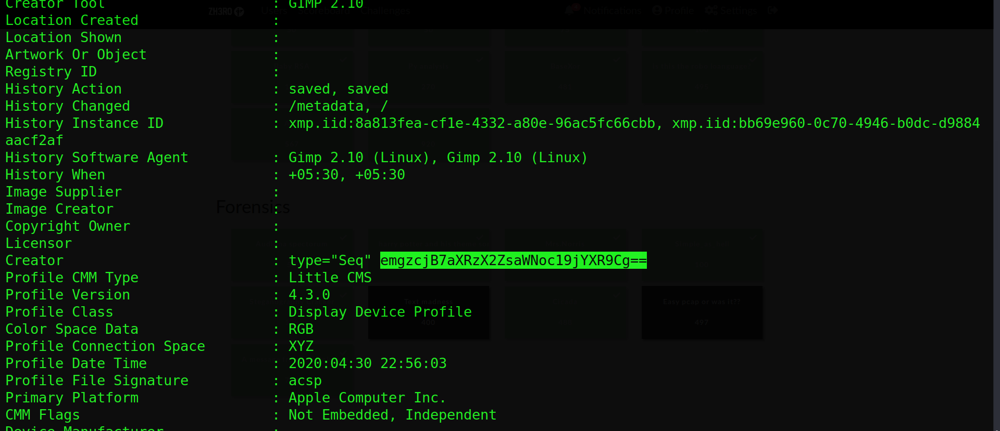

Lets go to our best friend cyberchef

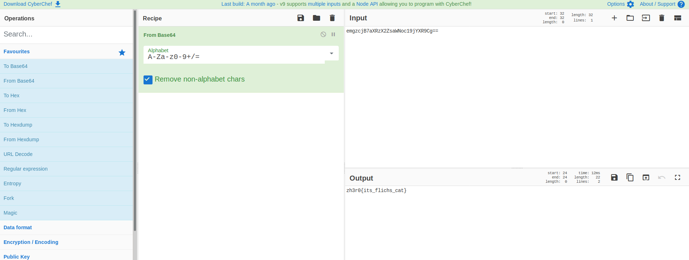


## Name - Simple_As_hell
## Category - forensics

we are given a jpeg and png ,lets use zsteg on png to get the pass

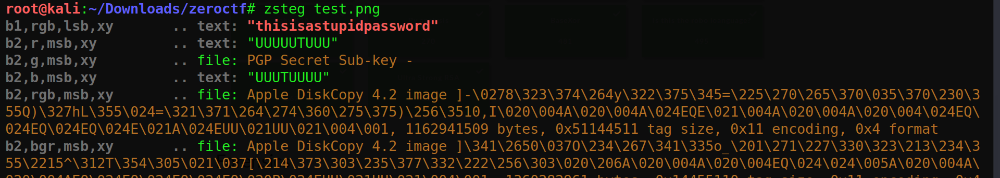

use this pass on image with steghide

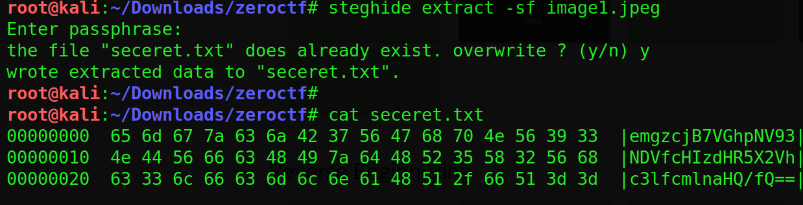

decrypt the base encoded string to get the flag

## Name - Steganography cracker
## Category - forensics

As the name suggest its about the stegcracker tool 
so don't try to crack the zip pass use stegcracker on the image given

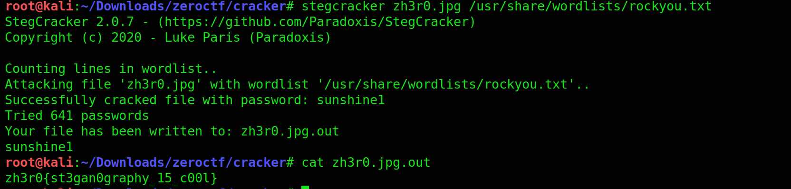

## Name - Cicada
## Category - forensics

given a flag.png and guessme.png
fix the flag.png it is something like this

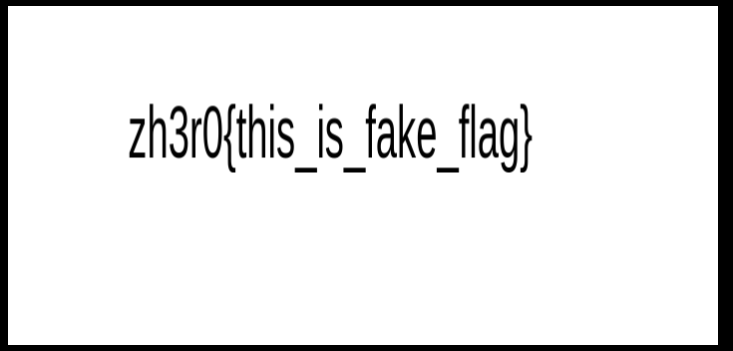

so it yields nothing with any other tools 

from challenge name cicada the steganography tool used here was **outguess**
we don't know the key 
lets try the fake flag as key 
and we get the flag :)

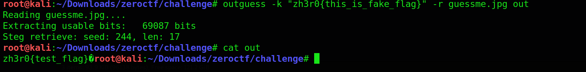

## Name - A message from the Universe
## Category - forensics

So here I got a lot of help from the author I will not waste time showing what other things i did 

I figured out the key was **Robot36** and the key was used to xor the whole wav file 
so we [xor-files](https://github.com/scangeo/xor-files) to xor to things ,apparent python way doesn't give us the intented result the author pointed out that to me


Lets decrypt first
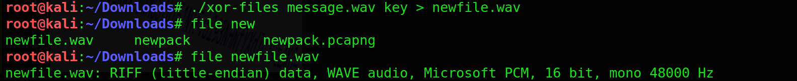

So we get an audio and from previous ctfs i knew that robot36 was reference to SSTV signals so you use any software like qsstv or the mobile Robot36 and play the audio and see the magic happening in front of your eyes

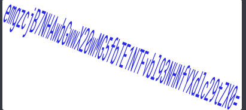

Decrypt base64 to get the flag!!!

Its been a long writup will do all master challs in next post!!
Hope you liked it