---

layout: post
title: Noobctf 0x1 pre-Ctf Writups
description: "Challenges that I found Interesting"
date: 2020-05-16
feature_image: images/noob01pre_ctf/front.png
tags: [CTF,Forensics]
published: true

---

<!--more-->

Lets start with Misc

## Decode it! , 80 Points

Read chall desc thats all 

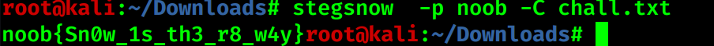

This was first challenge in stegsnow which used passwd for me

## ffs WashYourHands and StayInside ,175

So this was a easy challenge but I complicated it for myself ,you just need to see the http requests we see that its requestsing for a file named `who` from filedropper.com

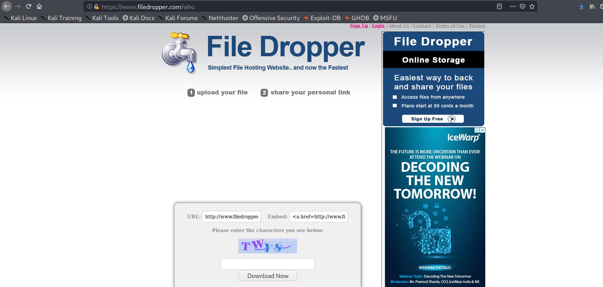

Just download the file its locked so mighty `John` will help us with it

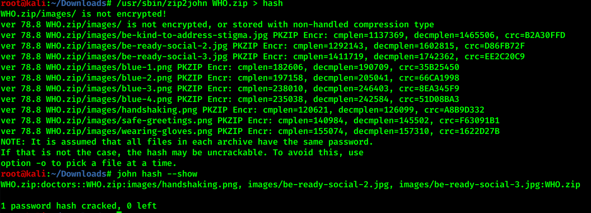

unzip and read the parts of flag distributed over images

## Bottled Something ,300

This was the only chall where the hint made sense ,we are given a base64 text decode it and put the contents in a new file it turns out to be a zip ,unzip it and we get a lot of sherlock images when I saw exif data I saw in some images that it was edited with ez gif maybe this was the main hint

opening them in browser shows that they are gif
I have shown them below maybe you cant see but these are the images needed to be opened with web browser

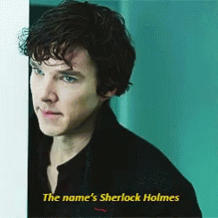

Now came the part of getting the QR
There are 2 ways either you take screenshot at the moment the QR appears ,
OR being smart like me take the slowmo video of gif then scan the QR with google lens

I do smart work not hardwork :)

## Web Steg,300

If I say in Hindi ,*Bohot hi wahiyad challenge tha yeh,dimaag ka bhosda kar ke rakh diya*

The hint said that we need to checkout the checkout page by that it meant the `dform.html`

I dont know what struck me I decided to copy the contents in sublime text just to have syntax highlighting
when I copied it I saw this

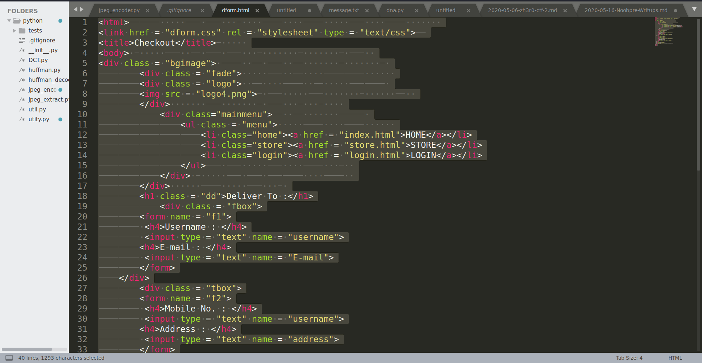

If you notice in right bottom you see that the character count is unusually high so I thought of stegsnow 
And I got the flag

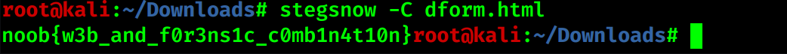

Moving on to forensics

## Shaktiman,50

Just repair the png and run `zsteg` not going to waste any more time on this

## D33p_div3,200

We are given with a jpg ,rather having large size ,running binwalk gives us something interesting 

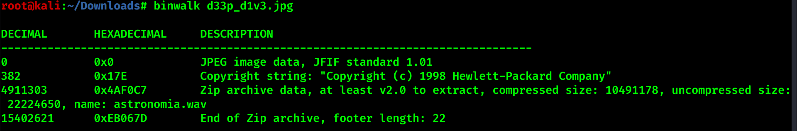

We get a wav file my first step always when I get a jpg,wav run steghide with empty pass it does work
Its shown below

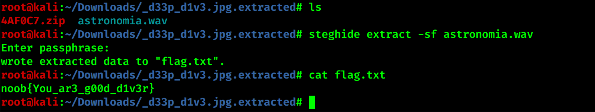

## An0nym0us G1rl_fri3nd,200

We are given a locked docx file, I find that we can crack the password using john so I do that

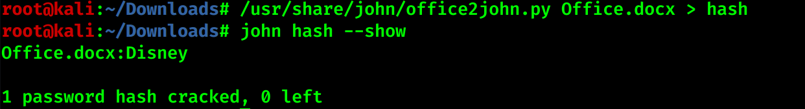

I dont have office in kali, so when I opened it in windows I saw that all the content was on single page but the file had 3 pages so I tried select all and saw that it had some invisible text
tried it with stegsnow without password but got nothing 

skip to when the hints were release I got that its a weak pass so I searched online for top weak pass and got that it was `12345678`
and got the flag

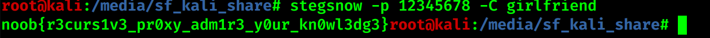

## Television Transmission,300

This challenge had some serious trolls ,it was not sstv but you should still try running it with robot36 if you wanna get trolled xd

After the hint was released I realised that it was a challenge where you need to write just 2 lines on terminal

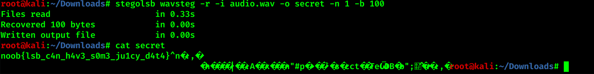

## Bin,300 

**NOTE**- I dont know how power-ranger guys solved this , extreme respect for them 

This had 0 solves,but after talking with the author we get that the tool is `stegsuite`

we get a png,On using zsteg  we get a  strange string from it, using it with filebin.net gets us the dragonfly image

one image is sufficient to explain the rest

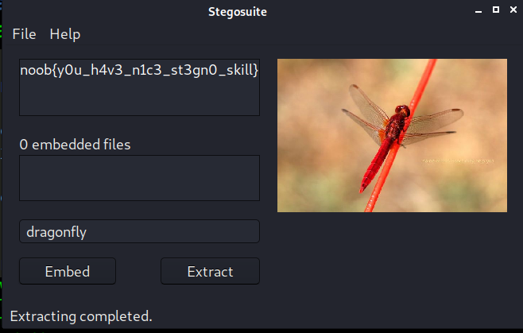

only one osint that I found interesting 

## PinG !t Bin,300

So I used sherlock and got the profile in Pinterest and thought that it had the flag as it matched with the chall name but it had nothing 

from sherlock it also show the profile on paste bin and here is the where our flag lies

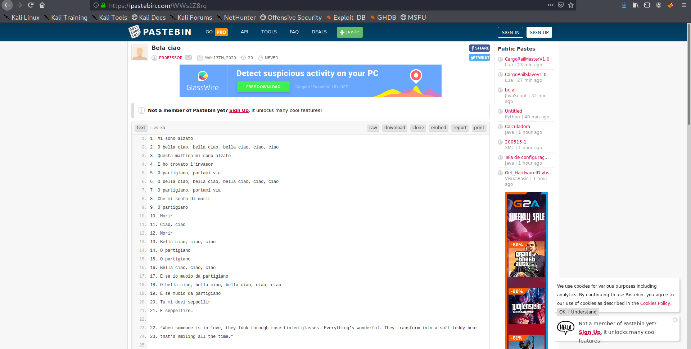

I did the decryption of the code on a notebook but you can run up a script for that 

One web chall

## Fake_IP,100

read the source of main.js in the site 

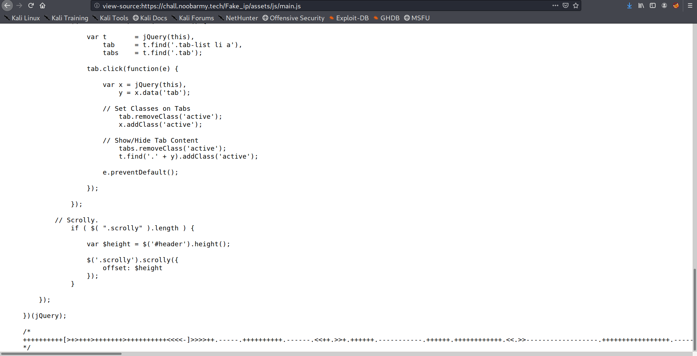

We se `BRAINFUCK` esolang just run with any decoder you like

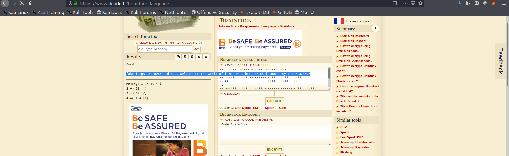

We got to that site the flag is divide into 3 parts 
1-base58 encoded
2-base64 encoded
3-base85 encoded

join them to get the flag

Leaving Crypto As they were relatively easy 

Did most of the challenges listening to this [track](https://www.youtube.com/watch?v=BD-ANbWYW1s) and others like them 

Hope you had fun reading the writup :)